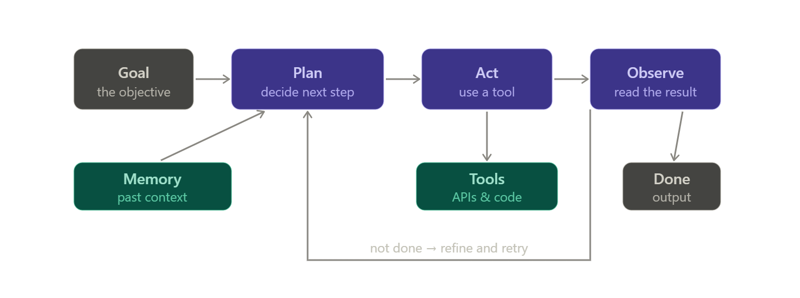
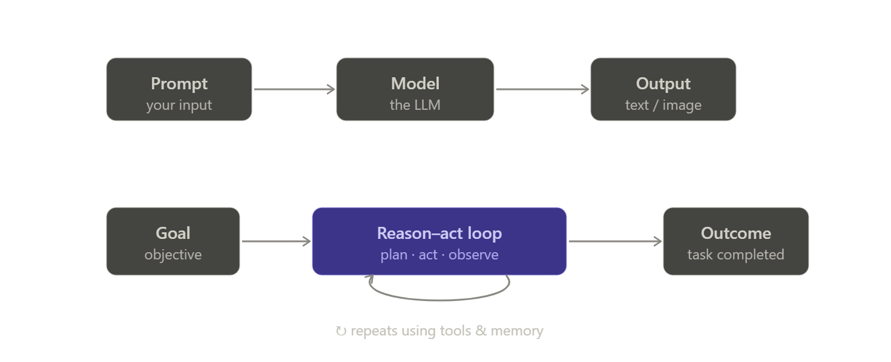
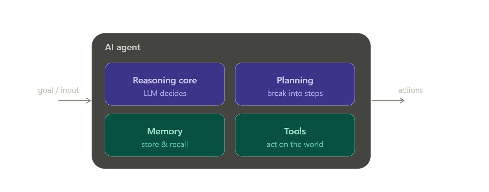
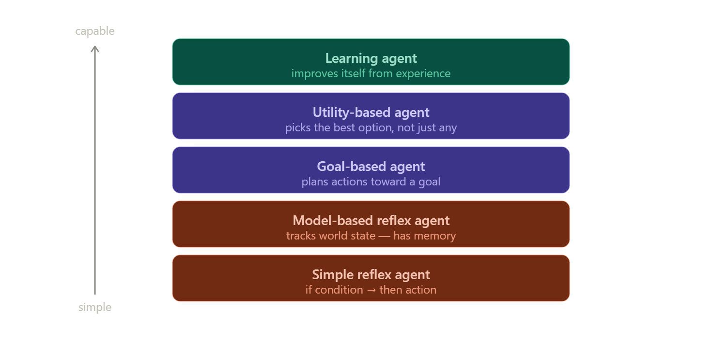
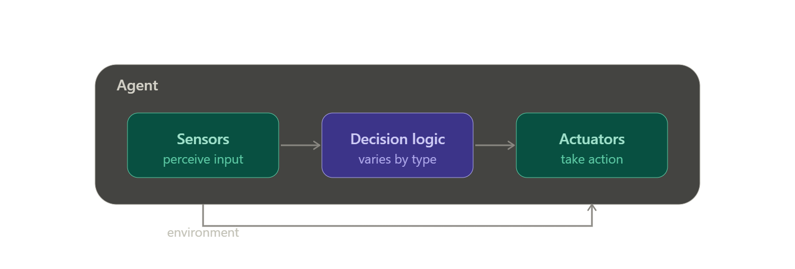
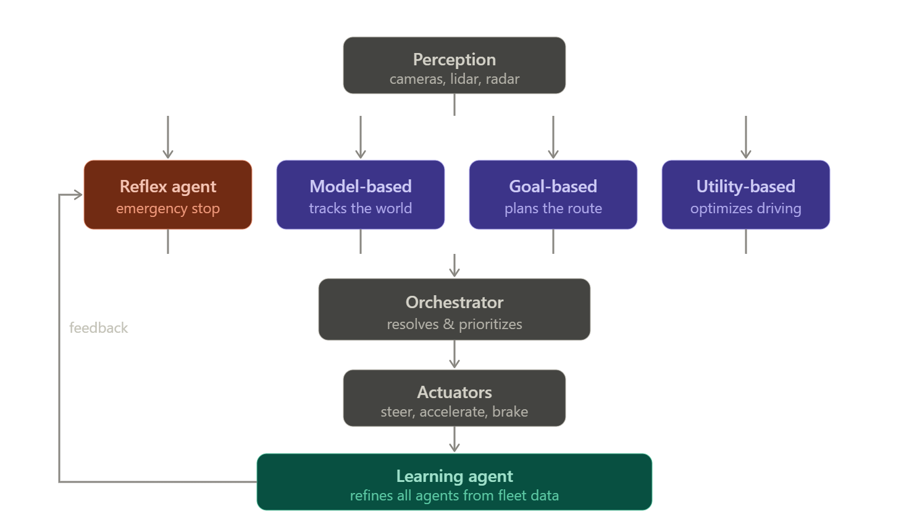
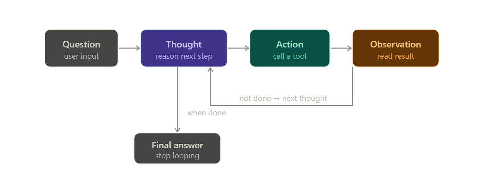
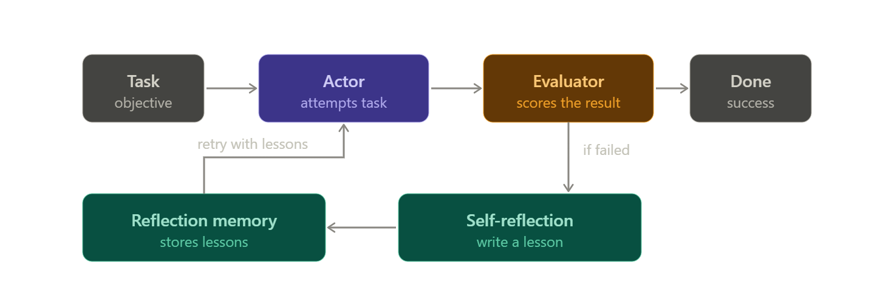
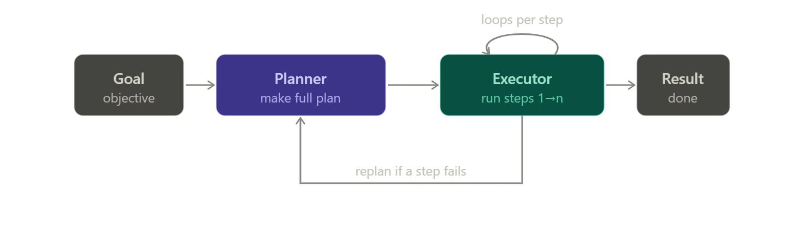

<h1 align="center">Agentic AI & Ai Agents — DeepLearning.AI Notes</h1>

<hr style="border:none;height:3px;background:linear-gradient(to right, #00bcd4, #673ab7);">

> **Question**
Explain:
>* What is Agentic AI. What are it's key features and advantages?
>* How is it different from the Generative AI, Give me the key differences?
>* What are AI agents and how they are related to the Agentic AI.

## 1. What is Agentic AI?

**Definition**
> **Agentic AI** is an approach to building AI systems that can pursue a *goal* on their own — breaking it into steps, deciding what to do next, taking actions in the real world (calling tools, APIs, code), observing the results, and *looping* until the goal is met. The key word is **autonomy**: you give it an objective, not step-by-step instructions.

The engine at the center is usually a large language model (LLM), but what makes it "agentic" is the **loop** wrapped around that model — a cycle of *reason → act → observe → repeat*.



*(In the diagram: **purple** = the reasoning loop, **teal** = the agent's resources. The loop repeats — plan, act, observe — feeding memory each turn until the goal is met.)*

**Key features**

- **Autonomy** — acts without step-by-step human prompting once given a goal.
- **Goal-directed behavior** — optimizes toward an *outcome*, not a single response.
- **Planning & reasoning** — decomposes a big task into ordered sub-steps.
- **Tool use** — calls external functions: `web_search`, `run_code`, database queries, APIs, sending email.
- **Memory** — retains context across steps (and sometimes across sessions) so it doesn't "forget" mid-task.
- **Adaptation / self-correction** — reads results, notices failures, and revises its plan.

**Advantages**

- Handles **multi-step, open-ended tasks** that a single prompt can't (e.g. "research 5 competitors and build a comparison sheet").
- **Reduces human micromanagement** — you delegate an outcome, not a checklist.
- **Interacts with live systems** — real data, real actions, not just generated text.
- **Recovers from errors** through the observe-and-retry loop.

**When & why to use it**

| Use it when… | Because… |
|---|---|
| The task has **many steps** or unknown branching | The loop figures out the path dynamically |
| It needs to **act on external systems** (APIs, files, DBs) | Tool use is the whole point |
| The workflow is **repetitive but not fully scriptable** | Adaptation handles the variability |
| **Outcome matters more than exact process** | You delegate the goal, not the steps |

**Avoid it when** the task is a single deterministic answer, latency/cost must be minimal, or errors are unacceptable without human review — the autonomy that helps in complex tasks becomes risk in simple, high-stakes ones.

> **🎯 Scenario-based interview questions**
> *Scenario: Your company wants an AI system that receives a customer support email, looks up the customer's order in the database, checks the shipping API, and drafts a resolution — end to end.*
>
> 1. **Why is this a good fit for agentic AI rather than a single LLM prompt?** (Expected: multi-step, requires live tool/API/DB access, branching logic, outcome-driven.)
> 2. **Which agentic feature lets the system recover if the shipping API returns an error?** (Expected: the *observe → re-plan* loop / self-correction.)
> 3. **What guardrail would you add before it sends anything to the customer, and why?** (Expected: a human-in-the-loop approval step — autonomy is risky on customer-facing actions.)

---

## 2. Agentic AI vs Generative AI — the key differences

This is the distinction interviewers probe most, because the names sound similar but the paradigms are different.

**Definitions side by side**

- **Generative AI** *produces content* — given a prompt, it returns text, an image, code, or audio in **one shot**. It answers.
- **Agentic AI** *pursues goals* — it wraps a generative model in a loop that plans, acts on external systems, and iterates. It *does*.

The cleanest mental model: **Generative AI is the brain; Agentic AI is the brain plus hands, memory, and a to-do list.



****Key differences at a glance**

| Dimension | Generative AI | Agentic AI |
|---|---|---|
| **Core job** | Produce content | Achieve a goal |
| **Interaction** | One prompt → one output | Goal → many steps in a loop |
| **Autonomy** | Passive, reactive | Autonomous, proactive |
| **External actions** | None — text in, text out | Calls tools, APIs, code, real systems |
| **Memory** | Usually stateless per call | Maintains state across steps |
| **Error handling** | You re-prompt manually | Self-corrects via observe → re-plan |
| **Relationship** | Is a *component* | *Uses* generative AI as its engine |

The last row is the one people miss: **agentic AI is not a replacement for generative AI — it contains it.** The LLM is the reasoning core inside the loop.

**When & why to use which**

- **Reach for Generative AI** when you want a single artifact: draft an email, summarize a document, generate an image, write a function. Fast, cheap, predictable.
- **Reach for Agentic AI** when the goal requires *doing several things in sequence against live systems*: "book the cheapest flight under $400 and add it to my calendar." No single generation can do that.

> **🎯 Scenario-based interview questions**
> *Scenario: A team built a chatbot on GPT-style model that answers HR policy questions. Leadership now wants it to also update the employee's leave balance and notify their manager when leave is approved.*
>
> 1. **Is the current chatbot generative or agentic? What changes when the new requirements are added?** (Expected: currently generative/one-shot Q&A; adding actions on live systems + multi-step flow pushes it into agentic territory.)
> 2. **Name two capabilities the system must gain to satisfy the new requirement.** (Expected: tool use / API calling to update balances & notify, and memory/state to track the multi-step transaction.)
> 3. **Does adopting agentic AI mean removing the generative model? Explain.** (Expected: No — the LLM stays as the reasoning core; the agent *wraps* it. Tests the "contains, not replaces" relationship.)

---

## 3. What are AI agents, and how do they relate to Agentic AI?

**Definition**
> An **AI agent** is the concrete *software entity* that perceives its environment, reasons about it (via an LLM), decides on an action, and executes it toward a goal. It is the **unit** — the actual thing that runs the loop from section 1.

An agent is typically made of four parts working together:



*(**Purple** = the agent's cognition — reasoning + planning; **teal** = its resources — memory + tools. A goal goes in, actions come out.)*

**How AI agents relate to Agentic AI**

This is a *thing vs. paradigm* relationship, and the cleanest way to hold it:

- **Agentic AI** is the **approach / paradigm** — the *idea* of building goal-pursuing, autonomous, looping systems.
- **An AI agent** is a **concrete implementation** of that paradigm — the actual running entity.
- **Agentic AI** as a *system* can be **one agent** (single-agent) or **many agents collaborating** (multi-agent), each specialized and coordinated by an orchestrator.

Think of it as: *Agentic AI is to AI agents what "object-oriented programming" is to a specific object.* One is the design philosophy; the other is the instance you build.

```
Agentic AI (the paradigm)
   └── implemented as → one or more AI agents (the units)
            └── each agent runs → the reason–act–observe loop
                     └── powered by → a generative model (LLM)
```

**Distinction to keep straight**

- **AI agent ≠ chatbot.** A chatbot generates replies; an agent takes actions toward a goal.
- **Agentic AI ≠ a single agent.** A full agentic *system* may orchestrate several agents (e.g. a "researcher" agent + a "writer" agent + a "reviewer" agent).
- **Agent ≠ workflow automation (RPA).** RPA follows fixed, pre-scripted rules; an agent *decides* its steps dynamically.

**When & why to use single vs. multi-agent**

- **Single agent** — the goal is cohesive and one reasoning context can hold it (e.g. "debug this file"). Simpler, cheaper, easier to trace.
- **Multi-agent (agentic system)** — the goal splits into distinct specialties, needs parallelism, or benefits from one agent checking another's work (e.g. "produce a market-research report": research, draft, fact-check). More powerful, but harder to coordinate and debug.

> **🎯 Scenario-based interview questions**
> *Scenario: You're designing a system to automatically triage incoming software bug reports: classify severity, reproduce the bug by running code, search internal docs for related issues, and assign it to the right team.*
>
> 1. **List the four components of the agent handling this, and map each to a task in the scenario.** (Expected: reasoning core → classify/decide; planning → sequence the steps; tools → run code + search docs; memory → recall related past issues.)
> 2. **Would you build this as a single agent or a multi-agent agentic system? Justify.** (Expected: either is defensible — key is the reasoning: distinct specialties like *reproduction* vs *doc-search* argue for multi-agent; simplicity and shared context argue for single. Interviewer wants the trade-off, not one "right" answer.)
> 3. **A candidate says "we're replacing our LLM with an AI agent." Correct the misconception.** (Expected: an agent isn't a replacement for the LLM — it *wraps* the LLM as its reasoning core and adds planning, memory, and tools. Tests the paradigm-vs-unit relationship.)

---

**Quick recap of the three:** Generative AI *creates*, an **AI agent** is a goal-pursuing unit that wraps a generative model in a reason–act–observe loop, and **Agentic AI** is the overall paradigm of building systems from one or more such agents.

<hr style="border:none;height:3px;background:linear-gradient(to right, #00bcd4, #673ab7);">

> **Question**
>Great, Now I want you to explain:
>Types of Ai Agents
>Explain each of them with good visualization and examples.
>Explain how a multiagent system can combine each types to achieve a complex task.

## The 5 classic types of AI agents

They form a **ladder of increasing sophistication** — each type keeps everything the simpler one could do and adds one new capability.



*(Color legend: **coral** = *reactive* agents that respond to the present; **purple** = *deliberative* agents that reason about the future; **teal** = the *self-improving* agent.)*

Before the details, here's the general wiring every agent shares — sensors in, some internal decision-making, actuators out. The five types differ only in **what lives in that middle box**.



The `Decision logic` box is the whole story. Here's what each type puts there.

**1. Simple reflex agent**
- **Definition:** Acts *only* on the current percept using fixed **condition-action rules** (`if X then Y`). No memory, no model of the world.
- **Decision logic =** a rule table.
- **Example:** A thermostat (`if temp < 20°C → turn on heat`); a keyword-based spam filter; a Roomba that reverses only when a bump sensor fires.
- **When/why:** Environment is **fully observable** and rules are simple and stable. Fast and cheap.
- **Weakness:** Blind to anything not in the current percept — can loop forever if the right rule isn't defined.

**2. Model-based reflex agent**
- **Definition:** Keeps an **internal state** (a model of how the world works) so it can handle **partial observability** — things it can't currently see.
- **Decision logic =** rules *plus* a maintained world state.
- **Example:** A robot vacuum that builds a map and remembers which rooms it already cleaned; a self-driving car tracking a cyclist that's momentarily hidden behind a truck.
- **When/why:** The environment is **partially observable** or history matters.
- **Distinction from #1:** The only addition is *memory of state*.

**3. Goal-based agent**
- **Definition:** Chooses actions by reasoning about the **future** — "will this action bring me closer to my goal?" Uses **search/planning**.
- **Decision logic =** state + explicit goals + planning.
- **Example:** GPS navigation planning a route to a destination; a chess engine searching moves toward checkmate.
- **When/why:** Many possible action sequences exist and you need the ones that *reach an objective*. It's flexible — change the goal, behavior adapts (no rule rewrite).
- **Distinction from #2:** Adds *goals + lookahead*.

**4. Utility-based agent**
- **Definition:** Not just "reach the goal" but "reach it **best**." Uses a **utility function** to score competing options and pick the highest-value one, even under uncertainty.
- **Decision logic =** goals + a utility/scoring function.
- **Example:** A GPS that weighs *time vs tolls vs fuel* and picks the optimal route; a trading agent maximizing risk-adjusted return.
- **When/why:** **Conflicting goals or trade-offs**, multiple valid solutions, uncertainty — you need "how good," not just "good enough."
- **Distinction from #3:** Goal-based asks *"does it work?"*; utility-based asks *"which works best?"*

**5. Learning agent**
- **Definition:** **Improves its performance over time** from feedback/experience. Structurally it adds a *learning element* (improves), a *critic* (evaluates), and a *problem generator* (explores) on top of any of the above.
- **Decision logic =** any of #1–#4 *plus* a mechanism that updates it.
- **Example:** A recommendation engine that adapts to your clicks; AlphaGo improving via self-play; an LLM agent that learns which tool-use strategies succeed.
- **When/why:** **Unknown or changing environments** where you can't pre-program every rule and want it to get better without reprogramming.
- **Distinction:** The others are static once deployed; this one *changes itself*.

> 💡 **Modern connection (interview gold):** The LLM agents from our earlier chats are essentially **goal-based + utility-flavored agents with optional learning**. Interviewers love when you bridge the classic taxonomy to modern agentic systems — it shows you understand both the theory and the practice.

---

## How a multi-agent system combines these types

A **multi-agent system** assigns each sub-problem to the *cheapest agent type that can solve it*, then coordinates them. You don't make one super-agent do everything — you use a fast reflex agent where speed matters and a deliberative agent where reasoning matters.

**Concrete example — a self-driving car** is a textbook multi-agent system:**How the types combine in that system:**



- The **reflex agent** owns *safety-critical reflexes* — a pedestrian steps out, it brakes in milliseconds. No time to "reason," so you deliberately use the dumbest, fastest type here.
- The **model-based agent** maintains the *world state* — where every car, lane, and sign is, including objects momentarily out of view.
- The **goal-based agent** does *route planning* — "reach the destination."
- The **utility-based agent** decides *how to drive* — trading off speed, comfort, fuel, and safety among many valid maneuvers.
- The **orchestrator** arbitrates conflicts (the reflex agent's "brake now" always overrides the utility agent's "smooth ride").
- The **learning agent** wraps the whole thing, improving every component from real-world driving data.

The core design principle: **match each subtask to the simplest sufficient agent type.** Reflexes stay fast and dumb; planning stays smart and slow; a coordinator resolves conflicts; learning improves everyone. This is exactly how modern multi-agent LLM systems work too (a fast "router" agent, specialist "worker" agents, a "critic" agent).

> **🎯 Scenario-based interview questions**
> *Scenario: You're architecting an automated warehouse. Robots must (a) stop instantly if a human enters their path, (b) know where every shelf and other robot is, (c) fetch a specific ordered item, (d) choose the most efficient pick sequence, and (e) get better at routing over months.*
>
> 1. **Map each of (a)–(e) to an agent type and justify.** (Expected: a→simple reflex, b→model-based, c→goal-based, d→utility-based, e→learning. Watch for reasoning, not just labels.)
> 2. **Why not implement the emergency-stop (a) as a goal-based agent?** (Expected: planning adds latency; safety reflexes must be instantaneous and deterministic — simplest sufficient type wins.)
> 3. **What is the role of an orchestrator, and give one conflict it must resolve.** (Expected: coordination/arbitration; e.g. reflex "stop" must override utility agent's "keep moving for efficiency.")
> 4. **A candidate insists a single learning agent should handle everything. What's the trade-off argument against that?** (Expected: harder to guarantee safety, debug, and verify; loss of modularity; a learned policy is a black box for a safety-critical stop. Specialization gives testability and predictability.)

---

**📌 Where to go next** — a few interview-worthy directions from here, in rough priority order:

1. **Agent architectures: ReAct, Reflexion, and Plan-and-Execute** — *how* modern LLM agents actually implement the reason–act loop. Very frequently asked and directly builds on everything above.
2. **Multi-agent orchestration patterns** (supervisor/worker, hierarchical, debate) — the practical version of what we just sketched; hot in current system-design interviews.
3. **Memory in agents** — short-term vs long-term, vector stores / RAG for agents. A common follow-up whenever you mention "memory."
4. **Tool use & function calling** — the mechanics of how an agent actually calls an API; often paired with a live coding question.

If I were prepping you for interviews, I'd rank **ReAct / agent reasoning loops (#1)** as the highest-value next dive — it's the concept that ties the theory to what teams are actually building. Want to go there next, or somewhere else?

<hr style="border:none;height:3px;background:linear-gradient(to right, #00bcd4, #673ab7);">

> **Question**
>I want you to explain the Agent architectures: ReAct, Reflexion, and Plan-and-Execute.

All of these are **control loops wrapped around an LLM.** They differ in 
- *when* the model thinks, 
- *whether* it critiques itself, and 
- *whether* it commits to a plan up front.

---

## 1. ReAct (Reasoning + Acting)

**Definition**
> **ReAct** interleaves **reasoning** ("Thought") and **acting** ("Action") in a single loop. At each step the model writes a thought about what to do next, takes an action (a tool call), reads the result ("Observation"), and repeats — until it decides to emit a final answer instead of another action.

The insight from the original paper: reasoning *alone* (chain-of-thought) hallucinates because it's ungrounded; acting *alone* has no strategy. Interleaving them lets the model **ground each reasoning step in a real observation.**



**What a ReAct trace literally looks like** (this is the actual text the model generates):

```
Thought: I need the current population of Tokyo, then compare to Delhi.
Action: web_search("Tokyo metro population 2025")
Observation: ~37 million
Thought: Now I need Delhi's.
Action: web_search("Delhi metro population 2025")
Observation: ~34 million
Thought: Tokyo is larger. I can answer now.
Answer: Tokyo, at ~37M vs Delhi's ~34M.
```

**Key components**

- **Thought** — a natural-language reasoning step (not shown to the user, usually).
- **Action** — a structured tool call the runtime parses and executes.
- **Observation** — the tool's return value, fed back into the context.
- **Stop condition** — the model emits `Answer` instead of `Action`.

**When & why to use it**

- **Use it** for tool-using tasks where the next step *depends on* the previous result: search, RAG, API lookups, calculations, DB queries. It's the **default architecture** for most single agents.
- **Why:** grounding in observations sharply reduces hallucination, and the interleaving is simple to implement and debug (you can log the trace).
- **Avoid / augment when:** the task is long-horizon (20+ steps) — ReAct's greedy, one-step-at-a-time nature drifts and burns tokens; or when the agent gets *stuck in loops* repeating the same failing action (this is what Reflexion fixes).

**Distinction:** ReAct is **reactive and greedy** — it never plans the whole task ahead (that's Plan-and-Execute) and it never critiques a *completed* attempt to try again (that's Reflexion). It decides one step at a time.

> **🎯 Interview Q&A — ReAct** *(mid-level, fullstack-flavored)*
> *Scenario: You're building a customer-support agent on ReAct that can query an orders API and a shipping API. In staging it sometimes calls the same API 10+ times in a row and never returns an answer.*
>
> **Q1. What's happening, and how do you diagnose it?**
> *A:* It's stuck in a reasoning loop — the model keeps choosing an action, the observation doesn't change its state, so it repeats. Diagnose by logging the full Thought/Action/Observation trace; you'll usually see identical thoughts. Your fullstack instinct applies: this is a loop with no progress guard.
>
> **Q2. Name three guardrails you'd add.**
> *A:* (1) A **max-iteration / step budget** that force-terminates the loop; (2) **loop detection** — hash recent (action, args) pairs and break/re-prompt if repeated; (3) a **timeout + token budget** per request. Bonus: return a graceful fallback to a human.
>
> **Q3. The orders API is not idempotent (calling "cancel order" twice double-processes). How does that change your design?**
> *A:* Tool calls in an agent loop can be retried or repeated by a confused model, so non-idempotent actions need protection you'd recognize from API design: idempotency keys, a confirmation/approval step before mutating actions, or splitting "read" tools (safe to repeat) from "write" tools (gated). This is a classic senior-signal answer.
>
> **Q4. How would you make the loop observable in production?**
> *A:* Emit structured logs/traces per step (thought, tool name, args, latency, tokens, observation), tag by a request/trace ID, and surface step count + total cost per session. Essentially distributed-tracing thinking applied to an agent.

---

## 2. Reflexion

**Definition**
> **Reflexion** adds a **self-critique loop on top of an acting agent.** After an attempt (a "trial"), an **evaluator** judges whether it succeeded. If it failed, a **self-reflection** step writes a short natural-language *lesson* ("I failed because I searched the wrong field"), stores it in memory, and the agent **retries the whole task** with that lesson in its context.

It's often called **"verbal reinforcement learning"** — it improves through *feedback in words*, without ever updating the model's weights.



**Key components** (memorize these — they're the standard exam answer):

- **Actor** — the agent that attempts the task (often a *ReAct* agent internally — Reflexion wraps ReAct).
- **Evaluator** — scores the attempt (a test suite passing, a reward signal, an LLM-as-judge, or ground-truth check).
- **Self-reflection model** — turns "you failed" into a *usable lesson* in words.
- **Reflection memory** — an episodic buffer of past lessons, injected into the next trial's prompt.

**The crucial distinction:** Reflexion learns **across attempts at the same task**, but *not* by changing weights — the "learning" is text accumulated in memory. Reset the memory and it's forgotten.

**When & why to use it**

- **Use it** when you have a **verifiable success signal** and retries are cheap enough: code generation (run the tests), math, puzzles, tasks where "did it work?" is checkable.
- **Why:** dramatically improves success rate on tasks where the first attempt often fails but the *reason* for failure is learnable.
- **Avoid when:** you can't cheaply evaluate success (no signal → nothing to reflect on), retries are expensive/irreversible (you can't "retry" sending money), or latency is tight — you're paying for multiple full attempts.

> **🎯 Interview Q&A — Reflexion** *(mid-level)*
> *Scenario: You're using Reflexion for an agent that writes SQL from natural language. The evaluator runs the query against a test DB and checks the result.*
>
> **Q1. What makes SQL generation a good fit for Reflexion specifically?**
> *A:* There's a **cheap, objective evaluator** — run the query, compare to expected output. Failures produce concrete signals (SQL error, wrong rows) that reflect into actionable lessons. Reflexion shines exactly when success is verifiable.
>
> **Q2. Where does the "learning" physically live, and what's the implication for a stateless API deployment?**
> *A:* It lives as **text in the reflection memory buffer**, not in weights. In a stateless HTTP service you must persist that buffer yourself (per-user or per-session store) and re-inject it, or the agent "forgets" between requests. This is a state-management question dressed up as ML — your fullstack background is the edge here.
>
> **Q3. How is Reflexion different from just increasing ReAct's max iterations?**
> *A:* More ReAct iterations = more steps *within one attempt*, still greedy and ungrounded in *why* it's failing. Reflexion **abandons the failed attempt, extracts a lesson, and restarts** with that lesson — it's an *outer* loop over whole trials, not a longer *inner* loop.
>
> **Q4. What's your stopping/cost-control strategy?**
> *A:* Cap the number of trials (e.g. 3), stop early on evaluator success, and budget total tokens. Since each trial is a full attempt, cost scales linearly with trials — set the ceiling based on how expensive failure-vs-retry is for the use case.

---

## 3. Plan-and-Execute

**Definition**
> **Plan-and-Execute** splits the work into two phases. A **Planner** reasons *once* up front and produces a **complete, ordered list of steps**. An **Executor** then carries out each step in sequence (each step may itself be a small ReAct agent). If reality diverges from the plan, it **re-plans**.

Contrast this with ReAct's "decide one step at a time." Here the strategy is committed **before** execution begins.



**Key components**

- **Planner** — usually the *strongest / most expensive* model; called rarely (once, or on replan).
- **Plan** — an explicit, inspectable list of steps (you can log it, show it to a user, even let them approve it).
- **Executor** — often a *cheaper* model or a ReAct agent, called per step.
- **Re-planner** — revisits the plan when a step fails or new information invalidates it.

**Why this split is powerful (the interview answer):** it **decouples reasoning from doing.** You can use an expensive frontier model for the one-time planning and a cheap fast model for the many execution steps — big **cost and latency** win on long tasks. You also get an **auditable plan** up front, which matters for trust and human approval.

**When & why to use it**

- **Use it** for **long-horizon, multi-step tasks** with a knowable structure: "research 10 companies, extract 5 fields each, build a report"; complex data pipelines; multi-stage workflows.
- **Why:** keeps the agent on-track over many steps (ReAct drifts), reduces expensive-model calls, and makes the plan visible.
- **Avoid when:** the task is short (planning overhead isn't worth it) or **highly unpredictable**, where any upfront plan is immediately invalidated — there, ReAct's step-by-step adaptivity wins.

> **🎯 Interview Q&A — Plan-and-Execute** *(mid-level → stretch)*
> *Scenario: You're building an agent that generates a competitor-analysis report: for each of 8 competitors, search the web, extract pricing and features, then synthesize a summary. On ReAct it was slow and expensive and lost track after ~15 steps.*
>
> **Q1. Why does Plan-and-Execute fix both the cost and the drift?**
> *A:* Drift: the explicit plan keeps the agent anchored to "8 competitors × 3 subtasks" instead of re-deciding each step. Cost: the pricey planner runs once; the 24 execution steps run on a cheaper model. Two wins from one architectural change.
>
> **Q2. How would you architect the executor for the 8 competitors — and what does your fullstack background suggest?**
> *A:* The per-competitor steps are **independent**, so parallelize them (fan-out/fan-in), like concurrent API calls — big latency win. Sequential dependencies (synthesis after extraction) form a simple DAG. This is orchestration you've done before with jobs/queues.
>
> **Q3. A competitor's site is down mid-run. Walk through the failure handling.**
> *A:* The failed step triggers **re-planning** (skip that competitor, mark data as unavailable, or retry with backoff), rather than aborting the whole task. Contrast: pure ReAct would have to reason its way out ad hoc. You'd add retries, timeouts, and partial-result handling — standard resilience patterns.
>
> **Q4 (stretch). When would you deliberately choose ReAct over Plan-and-Execute here, even knowing the drift risk?**
> *A:* If the task structure were **unknown until you start exploring** (you don't know how many competitors exist, or each finding changes the next question), a rigid upfront plan is worthless and ReAct's adaptivity wins. The choice is *predictable structure → plan; exploratory → react*. Naming that tradeoff crisply is a strong signal.

---

## Putting the three together

| | **ReAct** | **Reflexion** | **Plan-and-Execute** |
|---|---|---|---|
| **Core idea** | Reason + act, one step at a time | Attempt → critique → retry | Plan all steps, then execute |
| **Loop type** | Inner step loop | Outer loop over whole attempts | Plan once, execute many |
| **Adds over ReAct** | (baseline) | Self-reflection + memory | Upfront planning + step separation |
| **Best for** | Tool-using tasks, RAG | Verifiable tasks, retry-friendly | Long-horizon, structured tasks |
| **Main weakness** | Drifts / loops on long tasks | Needs a success signal; costly retries | Rigid if task is unpredictable |
| **Cost profile** | Moderate, one model | High (multiple attempts) | Efficient (cheap executor) |

They **compose**: a real production system often uses Plan-and-Execute at the top level, where **each step's executor is a ReAct agent**, and the whole thing is wrapped in a **Reflexion**-style retry when a verifiable checkpoint fails. Being able to say *"these aren't competitors, they're layers"* is exactly the kind of synthesis that separates a mid-level from a senior answer.

---

I'll pause here for your cross-questioning and doubts. Fire away — and once you're satisfied, tell me whether you want **Memory** or **Tool Calling** next. (My suggestion: if you found the "where does the learning live / stateless deployment" thread interesting, **Memory** is the natural continuation; if the "idempotency and non-idempotent tool" thread grabbed you, go **Tool Calling**.)

