<h1 align="center">RAG — DeepLearning.AI Notes</h1>

<p align="center"><em>Semantic Search · Contrastive Training · Embedding Geometry</em></p>

<hr style="border:none;height:3px;background:linear-gradient(to right, #00bcd4, #673ab7);">

> **Question**
>
> Explain the Semantic Search in RAG. How does embedding models use the contrastive training to associate the similar text vectors closer and dissimilar ones far apart. Explain this using some diagrams where I can visualize this change?

This is a great thing to visualize — the whole point of contrastive training is geometric, so let me explain it with diagrams that show the vectors actually moving.
## Semantic search in RAG

Keyword search (BM25) matches *literal tokens* — if the document doesn't contain the word, it can't find it. **Semantic search** matches *meaning*. Both the query and every document chunk are passed through the same embedding model, which maps each piece of text to a vector — a point in a high-dimensional space (often 384–3072 dimensions). The space is arranged so that **texts with similar meaning land close together**, even when they share no words. Retrieval then becomes a geometry problem: embed the query, and return the document vectors that sit nearest to it (measured by cosine similarity).

That's why a query like *"reset my password"* can retrieve a chunk titled *"steps to recover account access"* — different words, nearby vectors.

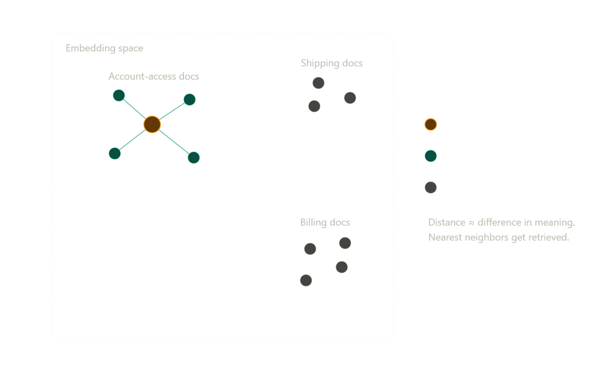

## How the space *learns* this geometry: contrastive training


The embedding model isn't born knowing that "reset password" and "recover account access" belong together. It **learns** that geometry through **contrastive learning**. The training data is built from triples (or pairs):

- an **anchor** — a piece of text (e.g. a question),
- a **positive** — something semantically related to it (a paraphrase, a relevant passage, an answer),
- one or more **negatives** — unrelated texts (often just the *other* examples in the same batch, which is cheap and effective — "in-batch negatives").

The training objective applies two opposing forces in vector space: **pull the anchor and its positive closer together, and push the anchor and its negatives apart.** Every training step nudges the model's weights so that this becomes a little more true. Do this over millions of triples and the whole space self-organizes by meaning.

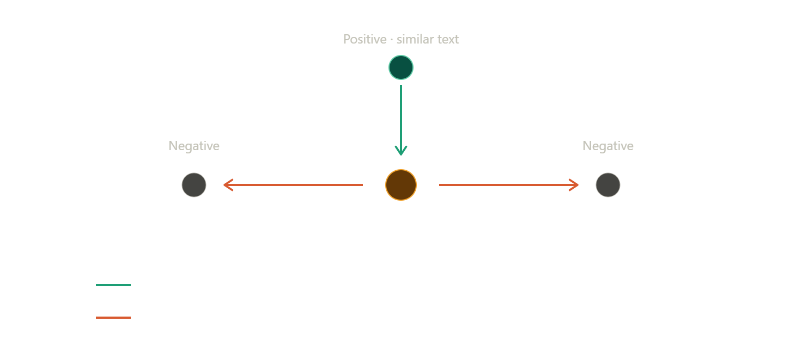

The two forces are encoded in a **loss function**. The common ones:

- **Triplet loss** — wants `distance(anchor, positive) + margin < distance(anchor, negative)`. It only "cares" until the negative is at least a margin farther than the positive.
- **InfoNCE / NT-Xent** (what most modern embedding models use, e.g. sentence-transformers) — treats it as a softmax classification: among the positive and all the negatives, the positive should get the highest similarity score. A **temperature** parameter τ sharpens or softens how harshly near-misses are penalized.

Conceptually, both do the same thing: maximize similarity to the positive, minimize it to the negatives.

## Visualizing the *change* — before vs. after training

This is the part you asked to see. At initialization the model's weights are random, so the embedding space is meaningless — texts about completely different topics are scattered and intermixed. After contrastive training, **the exact same texts** have been pulled and pushed into coherent, well-separated semantic clusters. The points didn't change; the *function that places them* did.

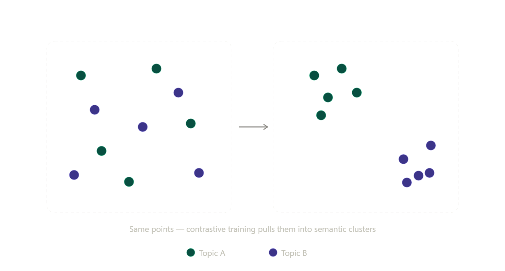

### Tying it back to RAG

Once trained, you freeze the model and use it as the encoder in your pipeline. Because "closeness in space" now equals "closeness in meaning," semantic retrieval becomes a nearest-neighbor lookup over those learned vectors. Everything downstream — hybrid search, reranking, the whole RAG loop — rests on this learned geometry.

Here's the mechanism in ~10 lines of Python so the math is concrete (this is the heart of InfoNCE / in-batch negatives):

```python
import torch
import torch.nn.functional as F

def info_nce(anchors, positives, temperature=0.07):
    # anchors, positives: (batch, dim) — row i is an (anchor, positive) pair
    a = F.normalize(anchors, dim=1)          # project onto unit sphere
    p = F.normalize(positives, dim=1)        # so dot product == cosine sim

    sim = a @ p.T / temperature              # (batch, batch) similarity matrix
    # diagonal = the true positive for each anchor; every off-diagonal entry
    # is an in-batch negative -> the "push apart" signal comes for free
    labels = torch.arange(a.size(0))
    return F.cross_entropy(sim, labels)      # pulls diagonal up, pushes rest down
```

The single `cross_entropy` call *is* the pull/push: it rewards a high score on the matching pair (the diagonal) and penalizes high scores everywhere else — exactly the two forces from the second diagram, applied across a whole batch at once.

If you want to go deeper for interview prep, the things worth being able to say out loud are: bi-encoder architecture (query and doc encoded independently, which is what makes precomputed document vectors possible), why normalization makes dot product equal cosine, the role of temperature τ, and why **hard negatives** (plausible-but-wrong texts) teach the model far more than random ones. That last point is a favorite follow-up question.

<hr style="border:none;height:3px;background:linear-gradient(to right, #00bcd4, #673ab7);">

> **Question**
>
> Can you explain these concepts:
> - **Bi-encoder architecture** (query and doc encoded independently, which is what makes precomputed document vectors possible)
> - **Why normalization makes dot product equal cosine**
> - **The role of temperature τ**
> - **Why hard negatives** (plausible-but-wrong texts) teach the model far more than random ones


You actually listed four (the "3" is a miscount, no worries) — let me take each in turn. These are exactly the follow-up details interviewers probe after the basic "what's contrastive learning" question.

### 1. Bi-encoder architecture

There are two ways to score how relevant a document is to a query.

A **bi-encoder** sends the query and the document through the encoder *separately*, producing one vector for each, and the relevance score is just the similarity between those two vectors. The key consequence: because the document is encoded without ever "seeing" the query, its vector is query-agnostic. So you can encode all your documents **once, offline**, store the vectors in your index, and at query time only encode the query (a single forward pass) and do fast vector math against millions of precomputed vectors. That precomputability is the entire reason vector search scales.

Contrast that with a **cross-encoder** (the reranker from your notes): it feeds the query and document *together* through the model so they can interact, and outputs a relevance score directly. Much more accurate, but the score depends on the pair, so nothing can be precomputed — you'd have to run the model against every document at query time, which is infeasible over a large corpus. That's why cross-encoders are confined to reranking a small candidate set.

The trade-off baked into a bi-encoder: it compresses an entire document into one fixed vector *before* it knows what's being asked, so fine-grained query-document interactions get lost. That information bottleneck is precisely why the two-stage "retrieve with a bi-encoder, rerank with a cross-encoder" pattern exists.

### 2. Why normalization makes the dot product equal cosine

Cosine similarity is `a·b / (‖a‖‖b‖)` — it measures the *angle* between two vectors and ignores their lengths. The raw dot product `a·b` alone conflates two things: direction *and* magnitude. A long vector can score a big dot product just by being long, even if it points in a mediocre direction — and vector magnitude often encodes things like document length or token count, not meaning. So you don't want magnitude leaking into your similarity.

If you L2-normalize each vector first (divide it by its own length so `‖a‖ = ‖b‖ = 1`), the denominator becomes 1 and `a·b` *equals* `cos θ` directly. Geometrically you're projecting every vector onto the unit sphere, throwing away length and keeping only direction.

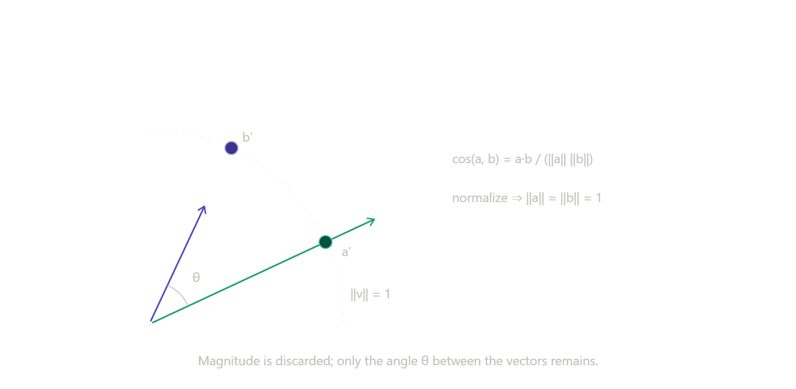

The practical payoff is twofold: you get to use the cheap, hardware-optimized dot-product operation (which ANN libraries and GPUs love) while keeping cosine semantics, and irrelevant magnitude variation stops distorting your rankings. This is why most embedding models emit normalized vectors by default.

### 3. The role of temperature τ

In InfoNCE you compute the similarities, **divide them by τ**, and *then* take the softmax. So τ rescales the logits before the softmax, which controls how sharp or flat the resulting probability distribution is — and therefore how aggressively the loss separates close pairs.

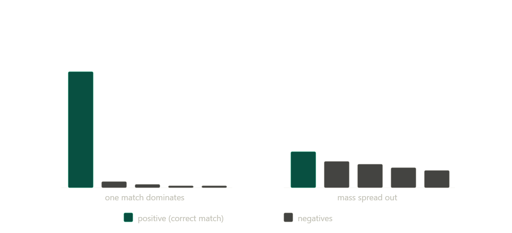


A **low τ** (e.g. 0.05) divides the similarities by a small number, which amplifies the gaps between them, so the softmax becomes very peaky — almost all probability mass lands on the single best match. The loss then punishes *any* negative that's even slightly close to the anchor very harshly, producing strong, aggressive separation. Push it too low and training becomes unstable and overfits to noise.

A **high τ** flattens the distribution, so the model treats near-misses leniently — smoother, more forgiving training, but the embeddings come out less discriminative. Common values for embedding models sit around 0.05–0.1. The reason temperature matters here connects directly to the last point: a low τ is what makes hard negatives actually *bite*.

### 4. Why hard negatives teach more than random ones

A negative's purpose is to teach the model "not this." But a random/easy negative is already obviously unrelated — for a query about resetting a password, a document about astrophysics. The model already scores it far away, so the loss on it is near zero, the gradient is near zero, and the model learns essentially nothing from it.

A **hard negative** is plausible-but-wrong: it shares surface features or topic with the anchor but isn't the right answer — for "how do I reset my password," something like "how do I reset my router" or "how do I change my username." The model is *tempted* to score it high, so it contributes a large loss and a large gradient, forcing the model to learn the fine distinction that actually separates the right answer from a convincing decoy.

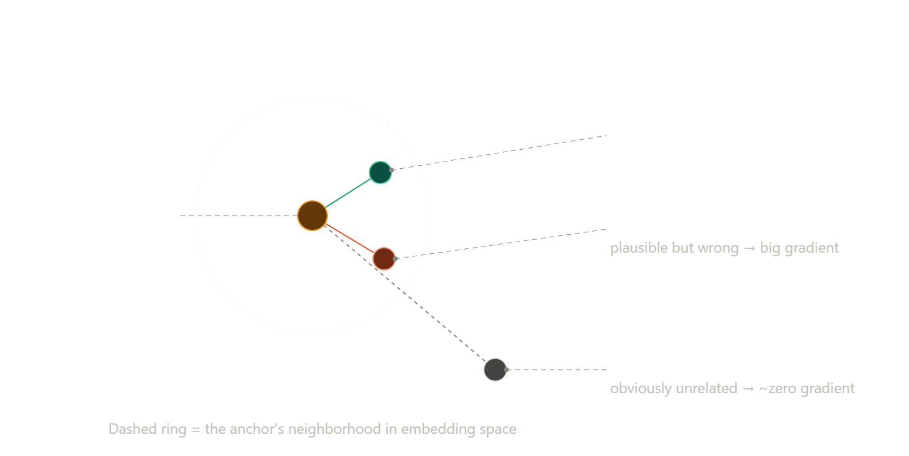

In practice, training mostly on easy negatives wastes compute and yields mushy, low-precision embeddings, so good pipelines **mine** hard negatives — e.g. take the top BM25 results that *aren't* the gold answer, or the current model's own near-misses, and feed those in as negatives. One caveat worth mentioning in an interview: with in-batch negatives you can accidentally sample a **false negative** — a "negative" that's actually relevant to the anchor — and punishing it confuses the model. So hard-negative mining is powerful but needs care to avoid poisoning the signal.

If you want the one-sentence synthesis tying all four together: a bi-encoder is the architecture that makes retrieval scalable, normalization makes its similarity measure clean, and temperature plus hard negatives are the two knobs that control *how sharply* contrastive training carves out the geometry that retrieval then relies on.

---

<hr style="border:none;height:3px;background:linear-gradient(to right, #00bcd4, #673ab7);">

> **Question**
>
> I want to understand the effect of Normalization of each vector, and how does making the dot product equal to the cosine theta affects our retrieval.

Good question to push on — normalization sounds like a trivial preprocessing step, but its effect on retrieval is concrete and occasionally decisive. Let me separate *what it does to each vector* from *what that does to your search results*.

## What normalizing each vector does

L2 normalization replaces every vector `v` with `v / ‖v‖`, which rescales it to length 1 while keeping its direction unchanged. Geometrically, every embedding — queries and documents alike — gets pushed onto the surface of the unit hypersphere. You keep *where it points* (the semantic content) and throw away *how long it is* (the magnitude).

The whole question of "does this matter for retrieval" comes down to: **is the magnitude you're discarding carrying useful information, or noise?**

## Why magnitude usually hurts retrieval

With the **raw dot product**, `q·d = ‖q‖ ‖d‖ cos θ`. The score is the product of both lengths *and* the angle. That means a document can earn a high score by being *long* rather than by being *relevant*. Embedding magnitude often correlates with things that have nothing to do with relevance — document length, token frequency, how generic or "confident" the text is, or plain training artifacts.

The classic failure mode is **hub documents**: one chunk happens to have a large-norm embedding, so it scores well against *many* unrelated queries and keeps surfacing in results where it doesn't belong. Meanwhile a genuinely on-topic but short, low-norm chunk gets buried beneath it.

Here's the effect made concrete — same query, two candidate docs, where the ranking flips purely based on whether you normalize:

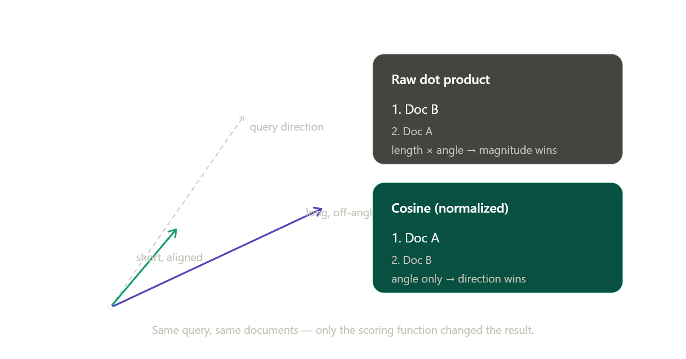

Putting numbers on it: say document A is almost perfectly aligned with the query (≈5° off) but short, while B is ~30° off but about 2.5× longer. The raw dot products go roughly as `‖A‖·cos5° ≈ ‖A‖` versus `2.5‖A‖·cos30° ≈ 2.2‖A‖` — B wins despite being less relevant. Normalize first, and you're comparing `cos5° ≈ 1.0` against `cos30° ≈ 0.87` — A wins, which is what you actually wanted. Normalization is what removes B's unearned length advantage.

## How "dot product = cosine" specifically affects retrieval

Once both query and document vectors are normalized, three useful things become true at the same time:

**You get cosine semantics from the operation your index is fast at.** ANN libraries (FAISS, HNSW-based stores) are built around two primitives: maximum inner product search (MIPS) and L2 distance. Cosine is *not* a native ANN primitive. But for unit vectors, dot product *is* cosine, so you can run cosine-quality retrieval on the heavily optimized inner-product path. And it's not an approximation — for normalized vectors the orderings are provably identical, because `‖a − b‖² = 2 − 2(a·b)`, so Euclidean distance is just a monotonic function of the dot product. Normalize, then dot-product, L2, and cosine all return the *same* top-k. Normalization is the trick that lets you pick whichever index type you have and still rank by meaning.

**Scores become bounded and comparable.** Cosine lives in `[−1, 1]`, so a similarity of 0.82 means the same thing for every query. That stability is what makes the rest of your pipeline work: a relevance threshold ("only keep results above 0.7") behaves consistently instead of drifting per query; RRF and other hybrid-fusion steps can combine scores sensibly; and near-duplicate detection can use a fixed cutoff. With raw dot products the scale floats with whatever the vector norms happen to be, so thresholds and fusion become unreliable.

**It forces consistency.** Because the geometry only behaves if *both* sides are on the unit sphere, you must normalize queries and documents the same way. A common, silent bug is normalizing documents at index time but forgetting the query at search time (or vice versa) — the ranking quietly degrades.

## The important caveat

Don't normalize reflexively — **match the similarity function the model was trained with.** Most sentence-embedding models (the sentence-transformers family) are trained with a cosine objective, so their magnitude is meaningless and you *should* normalize. But some dense retrievers are deliberately trained with the raw dot product (DPR-style models are the textbook example), and for those the norm is *learned signal* — it can encode things like specificity or how much information a passage carries. Normalizing those throws away information the model intended you to use, and retrieval gets worse. So the rule isn't "always normalize"; it's "use the metric the model was optimized for," which for the large majority of general-purpose embedding models means cosine, which means normalize.

**The one-line version for an interview**: normalization strips magnitude so ranking depends only on direction (meaning), and it converts cosine into the fast inner-product search your ANN index already accelerates — giving you bounded, comparable, magnitude-robust scores, provided the model was trained for cosine in the first place.

<hr style="border:none;height:3px;background:linear-gradient(to right, #00bcd4, #673ab7);">

> **Question**
Then in Azure Ai Search, during indexing we provide the cosine similarity.
>* Does it normalize before scoring the docs?
>* I know it uses the HNSW algo, does that mean it was trained to search for cosine similarity.
>* What will happen when the document is having a lot of unrelated but long docs and it ranks higher in BM25 keyword search.


Good questions — there are a couple of conceptual mix-ups worth untangling (especially the HNSW one), but let me ground the Azure-specific behavior in current docs rather than going from memory.Let me confirm the BM25 behavior in Azure for your third question.Good — these three questions actually hit on a subtle conflation worth clearing up (the HNSW one especially). Let me take them in order.

## 1. Does Azure AI Search normalize before scoring when you set cosine?

When you configure a vector field, you set `metric` in the HNSW profile, and the supported values are cosine, dotProduct, euclidean, and hamming — and Microsoft recommends cosine if you're using Azure OpenAI, otherwise the metric associated with your embedding model. So "cosine" isn't something that happens at indexing time per se — it's the *yardstick* you declare for how the index compares vectors.

The important practical point: cosine is magnitude-invariant *by definition* (it divides out both vectors' lengths). So when you choose the cosine metric, you do **not** need to pre-normalize your vectors to get angle-based ranking — Azure handles the angle comparison for you. This is exactly the place where the choice matters: if you had instead picked `dotProduct` as the metric, magnitude *would* affect scores, and you'd need to normalize your own vectors first to recover cosine behavior. With `cosine` selected, that's done for you. (Azure OpenAI embeddings happen to come out roughly normalized anyway, which is part of why cosine is the recommended pairing.)

One thing to know so you don't misread your results: for the cosine metric, the returned @search.score is not the actual cosine value between the query and document vectors — Azure applies transformations so the score function is monotonically decreasing. So the ordering reflects cosine similarity, but the number you see is a remapped score, not the raw cosine. Don't set a threshold like "keep cosine > 0.8" against `@search.score` expecting it to mean cosine 0.8.

## 2. HNSW does not mean it was "trained" for cosine

This is the conceptual mix-up worth fixing. **HNSW is not a trained model — it has no weights and no training.** It's a graph data structure (an approximate-nearest-neighbor *algorithm*). You don't train it; you *build* it from your vectors at index time, and you *traverse* it at query time. A vector query navigates the hierarchical graph, and at each step it selects candidate nodes that are closer to the query vector based on the configured distance metric, such as cosine.

So HNSW is **metric-agnostic**: it just needs *some* distance function to decide which neighbors count as "closer" while it builds the graph links and while it walks them. You hand it cosine (or L2, or dot product) and it uses that as its ruler. Picking `metric: cosine` doesn't train anything — it tells the graph which ruler to measure with.

The "trained for cosine" idea belongs to a completely different component: the **embedding model**. That's the encoder, and *that's* what contrastive training optimizes so that cosine in its output space reflects semantic similarity. The clean mental split:

- The **embedding model** is *trained* (via contrastive learning) so that cosine ≈ meaning.
- **HNSW** is *constructed* — a deterministic index that organizes and searches those vectors using whatever metric you configured.

Two separate stages. One learns the geometry; the other just navigates it quickly.

## 3. Long, unrelated docs ranking high in BM25

First, the reassuring part: BM25 is specifically designed to *resist* the "long document wins" problem, which plain TF-IDF suffers from. BM25 is a TF-IDF-like algorithm that includes length normalization (controlled by the 'b' parameter) and term-frequency saturation (controlled by the 'k1' parameter). In Azure the defaults are b = 0.75 and k1 = 1.2, and you can tune them. For b, a value of 0.0 means no length normalization is applied, while 1.0 means the score is fully normalized by document length, and normalizing term frequency by document length is useful precisely because longer documents are more likely to contain many irrelevant terms compared to shorter ones.

The k1 (saturation) parameter handles the other half: a document that repeats a query term dozens of times gets diminishing returns rather than a runaway score. Microsoft's own example is querying "Apollo Spaceflight" and wanting to lower the score of a Greek mythology article that contains "Apollo" many times but never mentions "Spaceflight," relative to an article that mentions both.

But here's the limit you're sensing: **BM25 is lexical — it has no idea what the document is *about*.** Length normalization fixes the *size* bias, but a long document that genuinely contains the query keywords scattered through unrelated context can still rank, because to BM25 a term match is a term match. It can't tell "relevant use of the word" from "incidental use of the word." Note this is a *different* mechanism from the vector-magnitude problem we discussed earlier: there, raw vector length hijacked the dot product; here, term frequency × document length is the lever, and BM25's `b`/`k1` are the lexical analog of L2-normalization. Same theme (size shouldn't masquerade as relevance), different knob.

So if irrelevant long docs are surfacing, the fixes in Azure, roughly in order of impact:

The single biggest one is **chunking** — don't index giant documents whole. If every chunk is a comparable, small size, the length problem largely evaporates and each chunk's keyword matches are about a focused passage. This is the standard RAG move and it helps both BM25 and vector retrieval.

Next, **hybrid search**: run BM25 and vector search together and fuse with RRF. The semantic (vector) signal pulls down a lexically-matching-but-topically-wrong long doc, because its meaning isn't actually close to the query. Azure does this fusion automatically when you combine the two in one request.

The strongest relevance fix is the **semantic ranker** (Azure's L2 reranker) on top of your initial results — it re-scores the top candidates with a deep model that judges actual relevance, not just term overlap, which is exactly what kills keyword-stuffed-but-irrelevant results.

And finally, if you must stay pure-lexical, **tune the parameters**: push `b` toward 1.0 to penalize length harder, and/or lower `k1` to cap the influence of repeated terms — though tuning chunk size usually does more for you than tuning b/k1.

The interview-ready summary across your three questions: cosine is a metric you *declare*, and it's magnitude-invariant so no manual normalization is needed (unlike dotProduct); HNSW is a built index that *uses* that metric, not a model that was *trained* on it; and BM25 already length-normalizes via `b`, but because it's lexical it can't judge topical relevance, so chunking + hybrid + the semantic ranker are what actually suppress long, keyword-heavy, off-topic documents.


<hr style="border:none;height:3px;background:linear-gradient(to right, #00bcd4, #673ab7)">

> **Question**
Great, Now we can move to the hybrid search and how it uses both the Keyword search and Semantic (Vector) search to score the documents:

>* Explain how the documents / chunks which is already ranked by Keyword & semantic semantic search are reranked using the RRF.
>* Use graphical representation anywhere that is required.
>* Give me the benefits of both the parameters k and beta in the hybrid score. 
>* At the end give me overview of how Azure Ai search implements hybrid search and performs the reranking.

Let me verify the current Azure-specific details (the RRF constant, weighting, reranker behavior) so the implementation section is accurate.Hybrid search is really just "run two independent searches and reconcile their two ranked lists into one." The interesting part is the reconciliation, because the two lists carry scores you can't directly compare. Let me build it up.

## The core problem RRF solves

BM25 (keyword) and vector (cosine) search each return their own ranked list, but their *scores* live on completely different, incomparable scales — a BM25 score might be 14.2 while a cosine-derived score is 0.83. You can't just add them. You *could* try to normalize both onto a common scale, but that's fragile and distribution-dependent. Reciprocal Rank Fusion sidesteps the whole issue by throwing away the raw scores and using only each document's **rank position**, which is comparable across any two rankers. RRF evaluates the scores from multiple previously ranked result sets to produce a single unified set, giving higher importance to items ranked highly in multiple lists.

## How RRF reranks the two lists

For every document, RRF sums a small "reciprocal rank" contribution from each list it appears in:

```
RRF_score(d) = Σ   1 / (k + rank_r(d))
             over each ranker r
```

where `rank_r(d)` is the document's 1-based position in ranker r's list, and `k` is a constant (Azure uses 60). A document gets a contribution from *each* list it shows up in, and contributions add up — so being present in *both* lists is rewarded.

Here's a worked example. Say keyword search ranks them `D1, D2, D3, D4` and vector search ranks them `D3, D1, D5, D2`. With k = 60:

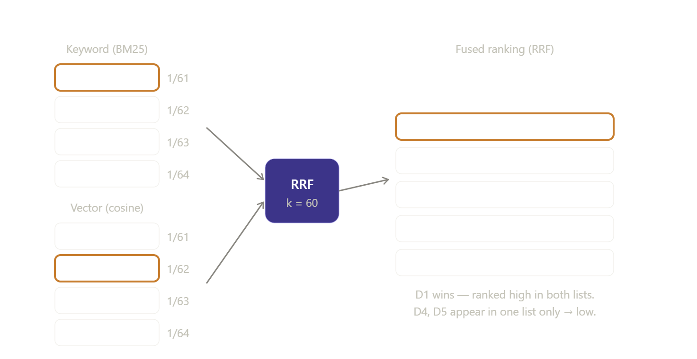

The teaching moment is **D1 vs. D3**: D3 was rank #1 in vector search, yet it loses the fused top spot to D1. Why? D1 is rank 1 in keyword *and* rank 2 in vector (1/61 + 1/62 ≈ 0.0325), while D3 is rank 1 in vector but only rank 3 in keyword (1/61 + 1/63 ≈ 0.0323). Consensus across both lists narrowly beats being the single champion of one. And notice D4 and D5, which each appear in only one list, fall far behind — a single contribution can't compete with two summed ones. This is the whole personality of RRF: it rewards documents that *both* retrievers mildly agree on, and no single retriever can force its favorite to the top alone.

One quirk to expect in practice: RRF scores look quite small even for strong matches — low scores are a characteristic of the algorithm by design, since each list contributes at most about 1/k.

## The benefit of the `k` parameter

`k` controls *how steeply rank position is discounted* — i.e., how much a document's exact position is allowed to matter versus simply showing up across lists.

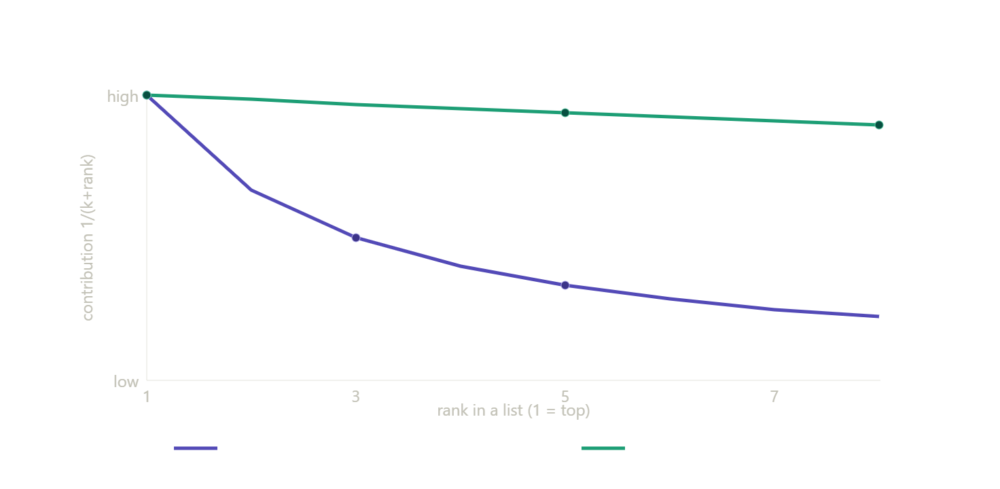

The benefits, depending on which way you turn it:

A **smaller k** makes the curve steep, so a #1 ranking is worth dramatically more than a #5. At k near 0 individual first-places dominate; at k ≈ 60 agreement dominates; at very large k the formula degrades into nearly equal weights, essentially summing positions. So small k is the right choice when you trust one retriever to be very *precise* at the top and want its best hits to lead.

A **larger k** flattens the curve so exact position barely matters and what counts is being present in multiple lists. The benefit is robustness: outliers can't dominate, and the result is the document "everybody mildly approves of." The reason ~60 is the near-universal default is that it sits in the sweet spot where consensus across retrievers wins without entirely ignoring position, and it does this with **no score normalization and no training** — a big practical benefit for scaling.

## The benefit of the weighting parameter β

`k` tunes rank *within* the formula; β tunes the *balance between the two retrievers*. (Naming varies — you'll see it as α or β; in a weighted RRF it's a multiplier on one retriever's contribution: `Σ wᵣ · 1/(k + rankᵣ)`.) The benefit is **domain adaptation without retraining**:

Tilt β toward the **keyword** side when exact lexical matching matters most — product codes, error IDs, legal citations, names, rare jargon — cases where the embedding model tends to "blur" precise tokens. Tilt β toward the **vector/semantic** side for conceptual or paraphrased queries where the user's wording won't literally match the documents. Because it's a continuous dial, you can A/B-test it against your eval set and bias retrieval toward whichever signal your corpus rewards, all at query time.

## How Azure AI Search implements this

Azure ties these pieces together as a single request:

When you issue a hybrid query, the text query and the vector query execute in parallel, then the results are merged and reordered using Reciprocal Rank Fusion into one unified set. Two things worth pinning down about the parameters in Azure specifically. First, the RRF `k` is an **internal constant fixed at 60 — it is not user-configurable**, and Azure explicitly warns that this RRF k is a constant entirely separate from the k that controls the number of nearest neighbors (the vector `k` you set *is* tunable, but it's a different knob — how many neighbors the vector search returns). Second, the β/weighting role is exposed through the vector query's `weight` property and the `maxTextRecallSize` window: increasing the lexical contribution increases the number of text candidates merged with the vector candidates, which is how you bias the fusion toward keyword or semantic.

Then the reranking layer sits *on top* of RRF. Semantic ranking occurs after RRF merging, and its score (@search.rerankerScore) is always reported separately in the response. So the fused RRF order is itself a first-stage reranking by rank, and the optional **semantic ranker** (Azure's deep "L2" model) is a second, more expensive stage that re-scores the top candidates by actual query-document relevance — and Microsoft recommends giving the semantic ranker the maximum number of documents (50). The full pipeline:

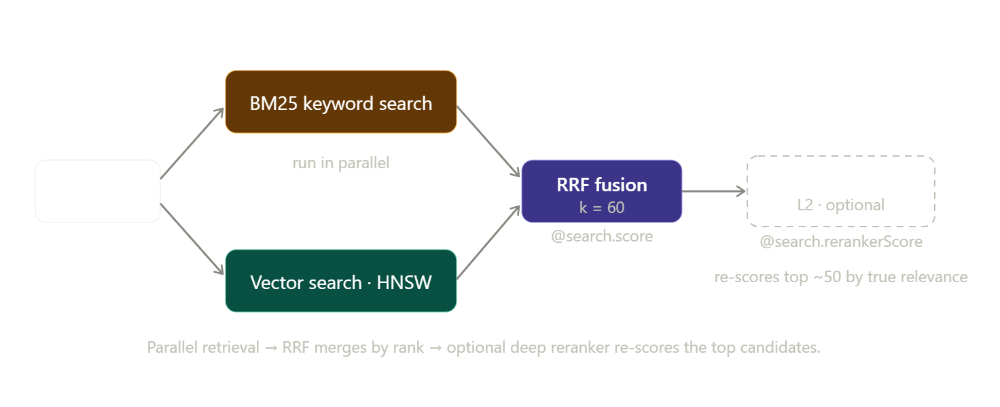

To put the two scores in context so you don't misread query output: `@search.score` is the RRF fused score (small by design, used for the merged ordering), and `@search.rerankerScore` — only present when semantic ranking is on — is the relevance score from the deep reranker and is what you'd actually sort your final top-N by. They coexist in the response rather than one overwriting the other.

The interview-ready synthesis: hybrid search runs BM25 and vector retrieval in parallel, then RRF reconciles their two ranked lists *by position* rather than by incomparable scores — summing `1/(k + rank)` so documents both retrievers agree on rise to the top. `k` tunes how much exact rank position matters (small = trust the top, large = trust consensus; 60 is the robust default), while the weight/β dial tunes the lexical-versus-semantic balance for your domain. In Azure that RRF `k` is fixed at 60, the balance is set via vector `weight` and `maxTextRecallSize`, and an optional semantic ranker re-scores the fused top candidates as a second stage, reporting its result separately as `@search.rerankerScore`.

<hr style="border:none;height:3px;background:linear-gradient(to right, #00bcd4, #673ab7)">

> **Question**
Great now I want to move on to the Retrieval Evaluation. Explain me:

>* The factors the retrieval quality depends upon. Specifically Prompt quality, ranked results and Ground truth.
>* Explain what is precision and recall and why they matters the most. Explain why there is tradeoff when we try to improve on one metric. How they fluctuate based on the top-k.
>* What is MAP@k. How does it reward the retrieved documents
>* What is Reciprocal Rank and what is MRR. What is it's importance.
>* How to use the Reacll@k, Precision & MAP and MRR and how they help increase the overall search quality.


You've got it — and thanks for the feedback, I'll keep this plain and in bullets. Here's retrieval evaluation built up step by step.

## 1. What retrieval quality depends on

Before any metric means anything, three things have to be in place:

**Query / prompt quality (the question you ask)**
- The query is the input. A vague or badly-phrased query gives weak results no matter how good the system is.
- For testing: your test questions should look like *real* user questions. Unrealistic test queries give you scores that lie.
- "Garbage in, garbage out" — it applies to the question, not just the documents.

**The ranked results (order matters, not just presence)**
- Retrieval returns an *ordered* list, not just a pile of docs.
- Finding a relevant doc is good; putting it at rank 1 is much better than rank 20 — because the LLM only reads the top few.
- So we judge two things: *did* we find it, and *how high* did we place it.

**Ground truth (the answer key)**
- This is the human-labeled list of which documents are truly relevant for each test query.
- Every metric compares your results against this key. No ground truth = nothing to measure against.
- If the key is incomplete or wrong, a good system can look bad. Its quality caps the quality of your whole evaluation.

## 2. Precision and Recall (the two you must know)

Simple analogy — you're fishing with a net:
- **Recall** = of all the fish in the lake, how many did you actually catch? (Did you miss any?)
- **Precision** = of everything in your net, how much is real fish and not trash?

The definitions:
- **Precision@k** = (relevant docs in your top-k) ÷ k → *"how clean are my results"*
- **Recall@k** = (relevant docs in your top-k) ÷ (total relevant that exist) → *"how much of the good stuff did I find"

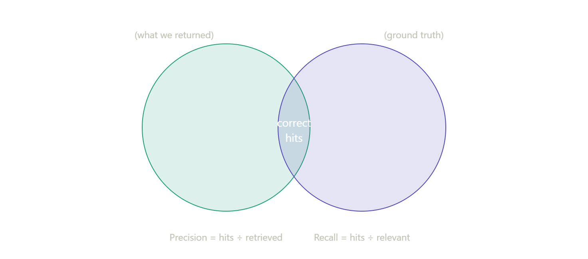

A running example we'll reuse: there are **3 truly relevant docs {A, B, C}**, and your top-5 comes back as:

- Rank 1 = A ✓, Rank 2 = ✗, Rank 3 = B ✓, Rank 4 = ✗, Rank 5 = C ✓

- At **k=3**: you found A and B (2 relevant). Precision@3 = 2/3 = **0.67**, Recall@3 = 2/3 = **0.67**.
- At **k=5**: you found all 3. Precision@5 = 3/5 = **0.60**, Recall@5 = 3/3 = **1.0**.

Why these two matter most:
- They're the foundation — almost every other metric is built from them.
- **Recall** tells you whether the answer is even in your results at all.
- **Precision** tells you how much noise the LLM has to read through to find it.

## 3. Why precision and recall trade off (and how top-k moves them)

- Increasing **k** (returning more results) can only hold recall steady or push it **up** — more slots means more chances to include the relevant docs.
- But precision usually goes **down** as k grows — the extra slots are mostly non-relevant, so the "fraction that's good" shrinks.
- The net analogy again: a bigger net catches more fish (recall ↑) but also scoops up more trash (precision ↓). You can't freely max both at once.

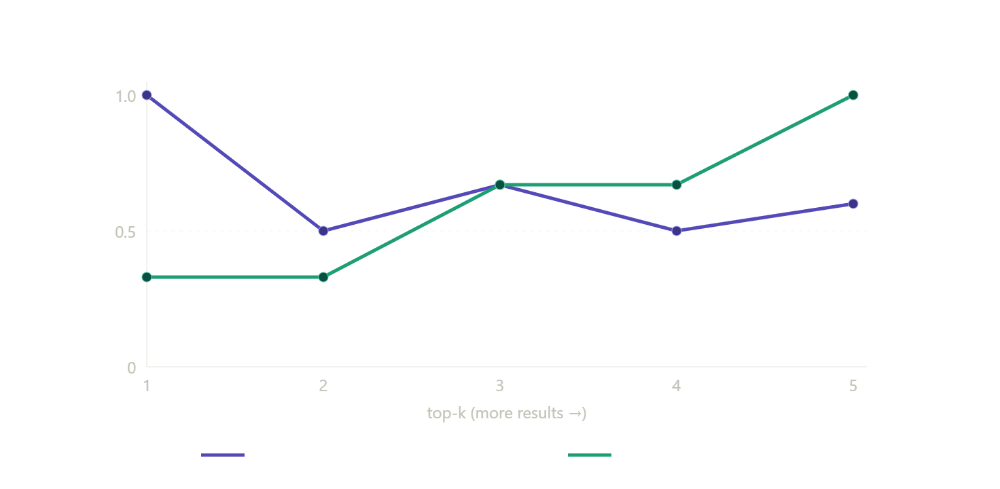

- The practical takeaway: use a **large k for first-stage retrieval** (grab everything relevant → high recall), then **rerank and keep a small k for the LLM** (cut the noise → high precision at the top). That's exactly the retrieve-then-rerank pattern.

## 4. MAP@k — rewarding good ordering

- What precision@k and recall@k miss: they don't care *where* inside the top-k the relevant docs sit.
- **Average Precision (AP)** fixes that: walk down the list, and each time you hit a relevant doc, note the precision *at that spot*; then average those numbers.
- Because precision is higher when relevant docs show up early, AP gives **more reward the earlier your hits land**.
- **MAP@k** = the average of AP across all your test queries (one AP per query, then average them).

Worked on our example (relevant at ranks 1, 3, 5):
- Precision at each hit: at rank 1 = 1.0, at rank 3 = 0.67, at rank 5 = 0.60
- AP = (1.0 + 0.67 + 0.60) ÷ 3 = **0.76**
- If those same 3 docs were at ranks 1, 2, 3 instead: AP = (1.0 + 1.0 + 1.0) ÷ 3 = **1.0** → better ordering, higher score.

Here's the "position matters" idea that both MAP and MRR are built on:

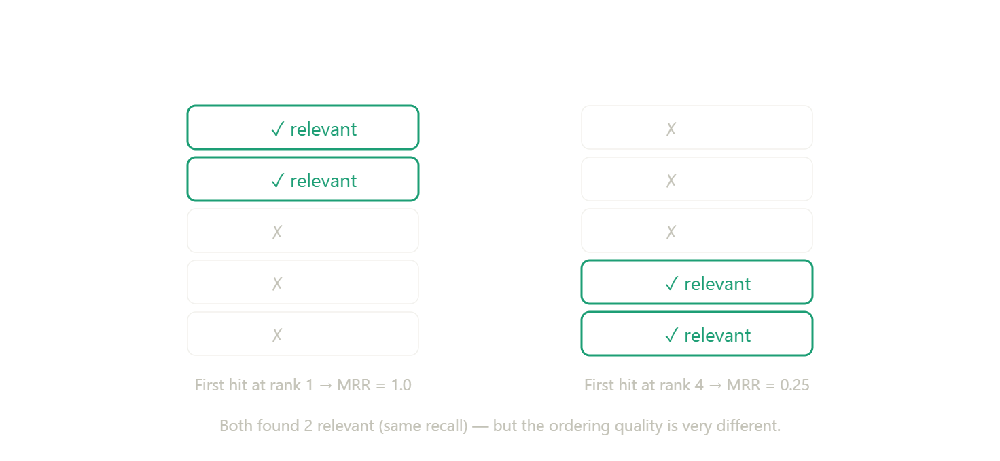

- In one line: **MAP rewards a system that puts *all* the relevant docs high, not just the first one.**

## 5. Reciprocal Rank and MRR

- **Reciprocal Rank (RR)** for one query = 1 ÷ (position of the *first* relevant result).
  - first relevant at rank 1 → RR = 1.0
  - at rank 2 → 0.5
  - at rank 4 → 0.25
  - none found at all → 0
- It only looks at the **first** good hit and how high it sits (you saw this in the diagram above).
- **MRR (Mean Reciprocal Rank)** = the average RR across all your test queries.

Worked example (3 queries):
- Q1 → first hit at rank 1 → 1.00
- Q2 → first hit at rank 4 → 0.25
- Q3 → first hit at rank 2 → 0.50
- MRR = (1.00 + 0.25 + 0.50) ÷ 3 = **0.58**

Why it matters:
- It's the right metric when you just need **one good answer, fast** — Q&A, chatbots, anything that feeds only the top 1–2 chunks to the LLM.
- It's simple and very sensitive to whether your *best* result is at the top.
- Its limitation: it ignores everything after the first hit — so use **MAP** when all the hits matter, and **MRR** when only the first one does.

## 6. Using them together to raise search quality

Each metric points at a *different* problem, so read them as a set:

- **Recall@k** (with a generous k) → *"Is the right doc even in my results?"*
  - If low → fix retrieval itself: better chunking, better embeddings, hybrid search, bigger k. A reranker can't fix what was never retrieved.
- **Precision@k** → *"How much junk is in my top results?"*
  - If low (but recall is fine) → add reranking, raise the score threshold, or shrink k.
- **MAP@k** → *"Are all the relevant docs ranked high?"*
  - If low → improve ordering: a reranker, or better keyword/vector fusion weights.
- **MRR** → *"Is the single best doc right at the top?"*
  - If low → reranking that surfaces the best chunk first; this matters most when you only pass 1–3 chunks to the LLM.

A simple workflow:
- **Step 1 — check Recall@k first**, with a big k. Confirm the relevant docs are being retrieved at all.
- **Step 2 — then check MRR / MAP / Precision.** These tell you whether the *ordering* is good.
- **Step 3 — recall good but MRR/MAP/precision bad?** Your retriever finds the docs but ranks them poorly → add or improve the reranker.
- **Step 4 — recall bad?** The docs aren't being found → go fix chunking, embeddings, hybrid search, or raise k.

The one-line summary: **recall = coverage, precision = cleanliness, MAP = overall ordering, MRR = speed to the first good hit.** No single number tells the whole story, but read together they tell you exactly which stage of your pipeline to fix next.

<hr style="border:none;height:3px;background:linear-gradient(to right, #00bcd4, #673ab7)">

> **Question**
Great, explanations. Now I am moving towards understanding the Vector databases and how do they calculate top-k documents / chunks related to a particular query.

>I want to understand why is it difficult for retriever using Vector search( cosine similarity and others) search to scale:

>* What are KNN algo and what are the limitations
>* What is ANN and how is it beneficial over KNN ones. What is a proximity graph and how does it make a significant improvement in search results.
>* What is Navigable Small world Algorithm and how it expands to HNSW. Is this what Azure Ai Search uses under the hood for faster search results.
>* How all these improvements help in scaling in production.

>Please make sure you explain using graphs, as it is easier to remember.


Great — this is one of the most satisfying topics to learn because it's so visual. Let me build it up from the scaling problem to HNSW, with a graph at each step. First, let me quickly confirm the current Azure specifics so that part is accurate.

Confirmed the Azure details — now here's the whole story from the scaling problem up to HNSW, with a graph for each step.

## What the vector database actually has to do

- It stores one vector per chunk — often millions or billions of them.
- Your query is turned into a vector too.
- Its job: find the **k vectors closest** to the query vector (by cosine / dot / L2). Those are your top-k results.
- The hard part isn't the math of one comparison — it's doing it *fast* across a huge pile of vectors, for many queries per second.

## Why vector search is hard to scale

- To find the closest vectors, you have to *compare* the query against stored vectors.
- The naive way compares against **every single one** — N comparisons per query.
- Each comparison is a dot product across hundreds or thousands of dimensions.
- So cost = (number of vectors) × (dimensions) × (queries per second). At millions of vectors this explodes.
- Unlike numbers on a line, high-dimensional vectors can't be neatly sorted or bucketed, so you can't easily "skip" most of them. This is the core difficulty.

## 1. KNN — the exact but slow way

- **KNN (k-nearest neighbors)** = measure the distance from the query to *every* stored vector, sort them, take the top k.
- Also called brute-force, exhaustive, or "flat" search.
- The good: it's **100% exact** — it always returns the true closest vectors.
- The limitations:
  - Cost is **O(N)** — it grows in a straight line with the number of vectors. 1M vectors = 1M distance calculations per query.
  - Latency balloons as your index grows — fine at 10k vectors, unusable at 10M.
  - It can't "prune" — every point gets checked, no shortcuts.

  
- ## 2. ANN — trade a tiny bit of accuracy for huge speed

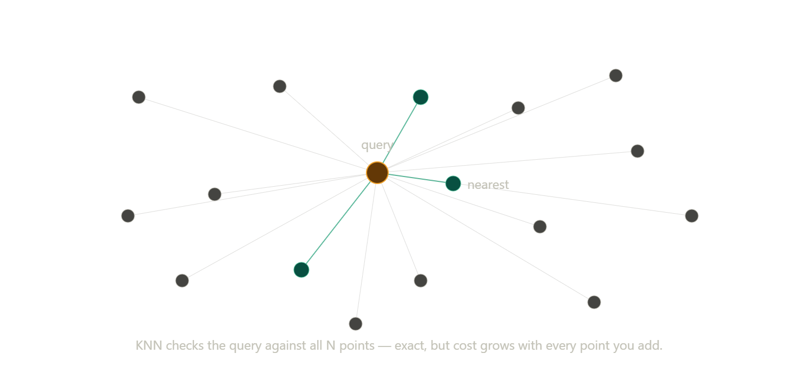

- **ANN (approximate nearest neighbors)** is built on one realization: for retrieval you rarely need the *exact* closest vectors — *"almost the closest"* is good enough.
- So ANN deliberately **skips checking everything** and looks only at a small, promising subset.
- The benefit over KNN:
  - Much faster — roughly **O(log N)** instead of O(N).
  - Still returns ~95–99% of the same results (this hit rate is its "recall").
  - ANN algorithms sacrifice some accuracy but offer scalable, faster retrieval, which makes them ideal for balancing accuracy and efficiency.
- The tradeoff is a dial: search more thoroughly → higher recall but slower; search less → faster but you might miss a neighbor.

**The proximity graph (the trick behind modern ANN)**

- Build a **graph**: every vector is a node, and each node is connected by edges to some of its nearby neighbors.
- To search: start at some node, look only at its neighbors, **jump to whichever neighbor is closest to the query**, and repeat — a "greedy walk" that moves downhill toward the query.
- You only ever touch a handful of nodes along the path, never all N.
- Why it's a big leap: instead of *scanning* everything, you *navigate* — like following road signs toward a destination instead of knocking on every door in the city.## 3. NSW → HNSW

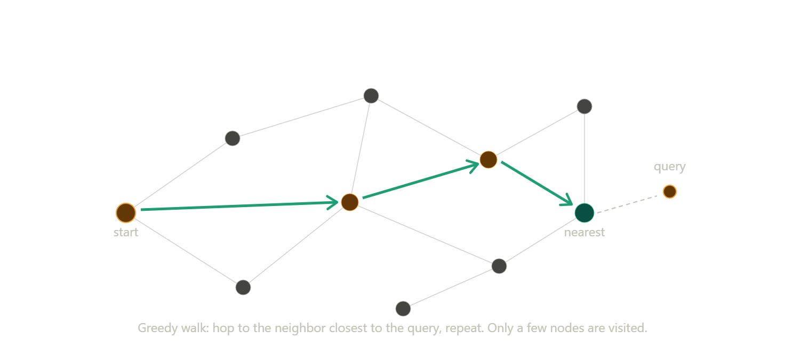

**Navigable Small World (NSW)**

- Built on "small world" networks — the idea behind "six degrees of separation," where almost any node can be reached in just a few hops.
- The graph mixes two kinds of edges:
  - **Short links** to very close neighbors → for homing in precisely at the end.
  - **Long links** that act as shortcuts across the whole space → for covering big distances fast.
- The greedy walk uses long links to jump near the target, then short links to fine-tune.
- Its weakness: in one big flat graph, as the data grows the walk can take many hops or get stuck wandering a local area.

**HNSW (Hierarchical NSW)**

- Adds **layers** — think of it like a skip list, but for a graph.
- Top layer: very few nodes with only long-range links → giant jumps across the space.
- Each layer down: more nodes, shorter links → progressively finer navigation.
- Bottom layer: **all** nodes, densest connections.
- The search: start at the sparse top, greedily walk to the closest node, then **drop down a layer** and continue refining — repeat until the bottom layer hands back the nearest neighbors.


**Does Azure AI Search use HNSW? Yes.**

- Azure AI Search supports two algorithms: HNSW, which performs approximate nearest neighbor search, and exhaustive KNN, which does a brute-force scan of the entire vector space. HNSW is the recommended default for production; the search service builds the HNSW graph during indexing and a query navigates it level by level.
- It exposes the standard HNSW knobs (with Azure defaults): m, the bi-directional link count (default 4); efConstruction, the neighbor list size used during indexing (default 400); efSearch, used during search (default 500); and metric (cosine for Azure OpenAI embeddings). In the graph picture above, `m` is roughly how many edges each node gets, and `efSearch` is how widely it explores before settling — bigger `efSearch` = higher recall but slower.
- Exhaustive KNN is still there as an option: it's computationally intensive, so it's meant for small-to-medium datasets, or for building a ground-truth set to evaluate the recall of the ANN algorithm. (Handy: run eKNN once to get the "true" answers, then measure how close your HNSW recall gets.)

## 4. How this all helps scaling in production

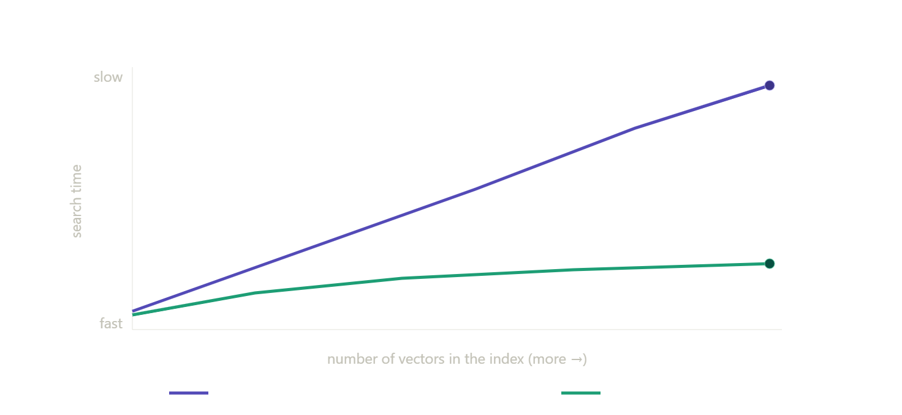

- **The shape is everything** (the graph above): KNN's cost rises in a straight line, so 10× the data ≈ 10× the latency. HNSW rises roughly logarithmically, so 10× the data adds only a little time. That gap is what makes "search 100M chunks in milliseconds" possible.
- **The cost you pay is memory.** HNSW stores all those graph edges and must stay resident in memory during queries because graph traversal needs fast random access, whereas exhaustive KNN is loaded in pages and doesn't consume the vector index quota. Speed in exchange for RAM — a deliberate trade.
- **It's tunable per workload.** The `efSearch`/`m` knobs let you slide between "fast and lighter" and "more accurate," so a low-latency app and a high-recall app can use the same engine with different settings.
- **It fits the retrieve-then-rerank pattern.** ANN quickly fetches a generous, high-recall candidate set, and a reranker then sharpens precision at the top — you already saw why this two-stage shape wins.

**The thread tying it together:** "calculate top-k" really means *find the k closest vectors without looking at all of them*. KNN looks at all of them and doesn't scale. ANN navigates a proximity graph instead of scanning. NSW makes that graph navigable with short + long links, and HNSW stacks it into layers so the walk takes ~log(N) hops instead of N comparisons. Azure AI Search implements exactly this with HNSW (plus exhaustive KNN when you need exact results), which is why its vector search stays fast as your index grows into the millions.

<hr style="border:none;height:3px;background:linear-gradient(to right, #00bcd4, #673ab7)">

> **Question**
Great, now please clear a few of my doubts:

>* Is HNSW a hybrid search? How does it re-rank the results of Keyword and vector search
>* Which Key word search and vector calcuation is used in Azure AI search for HNSW.
>* Explain the full flow of hybrid search with Vector, Keyword search components.
>* Also explain the precision, recall, Map@k, MRR@k metrics using HNSW.

>Explain everything using relative graphs, scoring tables, and visuals.


Good — there are a couple of genuine mix-ups hiding in these questions, so let me clear those first, because getting the *roles* straight makes everything else click.

## The big correction: HNSW is **not** hybrid search

- **HNSW is only the vector engine.** Its single job is to find the nearest *vectors* fast (the ANN algorithm from last time). That's all it does.
- It knows **nothing** about keyword search, and it does **not** combine or re-rank keyword + vector results.
- The thing that combines the two ranked lists is **RRF** (and, optionally, the semantic ranker afterwards) — never HNSW.
- Quick way to remember it: HNSW is the engine inside *one* of the two cars; **RRF is the referee** that compares where the two cars finished.

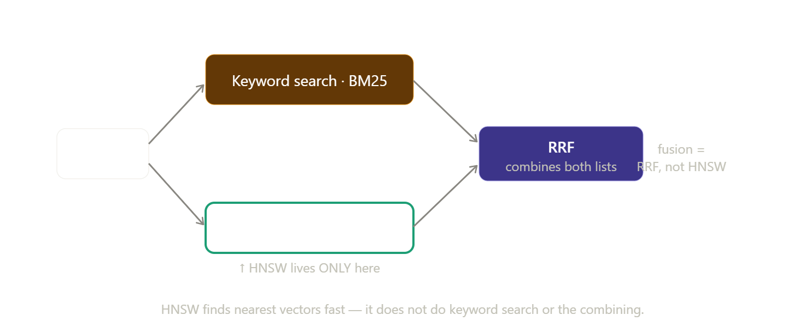


## Which algorithms Azure AI Search uses

- **Keyword side = BM25.** Azure runs full-text search with BM25 over an **inverted index** (the Lucene-style "which documents contain this term" lookup). It handles exact terms, stemming, etc.
- **Vector side = HNSW with a similarity metric.** The HNSW graph does the fast nearest-neighbor walk, and the actual "how close are these two vectors" calculation uses the metric you configure — cosine by default for Azure OpenAI embeddings, with dotProduct, euclidean, and hamming also supported. So "HNSW" = *how* it searches; "cosine" = *what distance* it measures while searching.

| Component | Algorithm in Azure | What it compares | Data structure |
|---|---|---|---|
| Keyword search | BM25 | exact terms (with stemming) | inverted index |
| Vector search | HNSW + cosine *(default)* | meaning / vector closeness | HNSW graph |
| Combine the lists | RRF (k = 60) | rank positions only | — |
| Final re-rank *(optional)* | Semantic ranker (L2) | true query–document relevance | deep model |

## The full hybrid search flow

- **Step 1 — one query, two paths (in parallel):**
  - The raw text goes to **BM25** over the inverted index → ranked list #1.
  - The query is **embedded** into a vector, which goes to **HNSW** over the vector index (using cosine) → ranked list #2.
- **Step 2 — fuse:** **RRF** merges the two ranked lists by *rank position* (not raw scores), producing `@search.score`. This is the first "re-ranking," and it's RRF's job, not HNSW's.
- **Step 3 — optional deep re-rank:** the **semantic ranker (L2)** re-scores the top ~50 fused results by actual relevance, producing `@search.rerankerScore`.
- **Step 4 — return** the top-N, which you feed to the LLM.

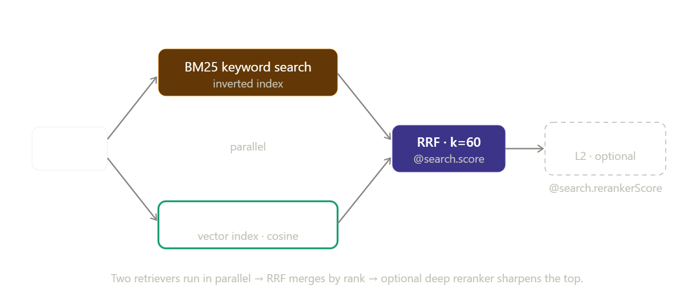

## The metrics, applied to HNSW

Here's the subtle part. HNSW is **approximate** — to stay fast, it only visits *some* nodes, so it can occasionally **miss a true nearest vector** that exact KNN would have found. That gives the metrics a special meaning when you evaluate HNSW itself:

- **The "ground truth" for HNSW = the exact KNN result** (the truly closest vectors). You run slow-but-exact KNN once to get the right answers, then check how close HNSW gets.
- **Recall@k is the headline HNSW metric** = (how many of the *k* true nearest neighbors HNSW returned) ÷ k. This is literally what people mean by "HNSW recall," and it's the dial you tune with `efSearch`.
- **Precision@k** ends up equal to recall@k here, because you ask for k results and there are exactly k true neighbors.
- **MRR** = is the *single* closest vector right at the top? (HNSW almost always nails rank 1, so MRR stays high.)
- **MAP@k** = did HNSW keep the true neighbors high *and* in good order, not just find them?

Worked example — exact KNN says the 5 truly nearest are `A, B, C, D, E`, but approximate HNSW returns `A, B, C, D, F` (it skipped E and grabbed a farther vector F instead):

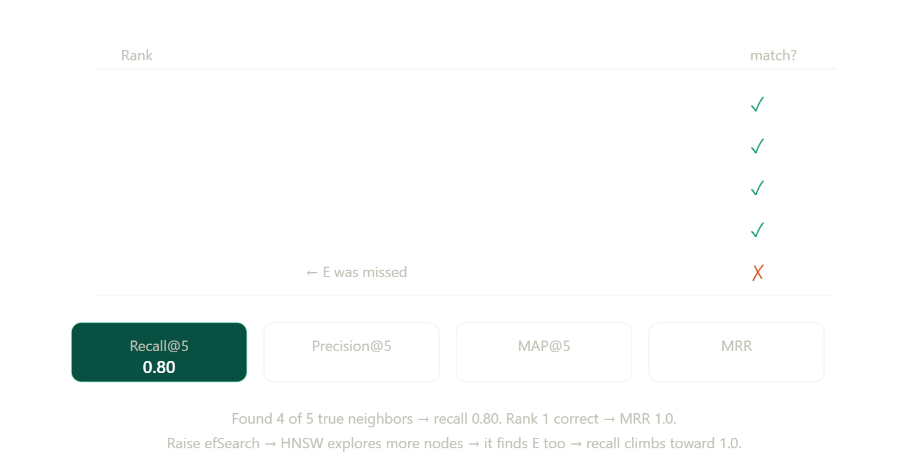

- **How the math worked:** HNSW found 4 of the 5 true neighbors → Recall@5 = 4/5 = **0.80**. Four of its five returned docs are true neighbors → Precision@5 = **0.80**. Those 4 sit at ranks 1–4 (precision 1.0 at each hit), so MAP@5 = 4.0/5 = **0.80**. And rank 1 is correct, so MRR = **1.0**.
- **The knob:** that one miss is the price of speed. Turn `efSearch` (or `m`) up → HNSW visits more nodes → it stops missing E → recall climbs back toward 1.0, at the cost of latency. That's the recall-vs-speed dial in action.
- **Two layers of "recall" to keep separate:**
  - *ANN recall* — how well HNSW matches exact KNN (measured against exact-KNN ground truth, as above).
  - *End-task recall* — how well the system finds the docs a human labeled relevant (measured against relevance ground truth, like the last topic).
  - They stack: if HNSW's ANN recall drops, it can silently drop a relevant doc, which then hurts your end-task recall, MAP, and MRR downstream. So low retrieval quality sometimes traces all the way back to `efSearch` being set too low.

## Putting your four doubts to rest

- **Is HNSW hybrid search?** No. HNSW is *only* the vector retriever; it doesn't touch keyword results or do fusion.
- **What re-ranks keyword + vector?** RRF (by rank position), then optionally the semantic ranker (by relevance) — never HNSW.
- **Which algorithms?** Keyword = BM25 over an inverted index; vector = HNSW walking the graph with cosine distance.
- **Metrics with HNSW?** Same precision / recall / MAP@k / MRR you already know, but with exact KNN as the "right answers" — and recall@k is the key one because it directly measures how much HNSW's approximation is costing you, tunable via `efSearch`.

<hr style="border:none;height:3px;background:linear-gradient(to right, #00bcd4, #673ab7)">

> **Question**
Another doubt:

>* When we say that KNN's result is the ground-truth for the Azure Ai Search's HNSW algo, does it mean that Keyword search (for e.g. 10M docs) are done before the HNSW is fired.
>* If not then how is HNSW grounding itself and how does recall is affected while reranking the combined output.


Excellent doubt to raise — there are two things tangled together here, and pulling them apart fixes the whole picture.

## Short answer

- No. Keyword search is **not** run before HNSW, and exact KNN is **not** run at query time at all.
- Two separate mix-ups are causing this: (1) the "KNN" that acts as ground truth is *not* keyword search, and (2) "ground truth" is an *offline evaluation* idea, not a step in a live query.

## Mix-up 1: the "KNN" ground truth is not keyword search

- The KNN we called "ground truth" = **exhaustive vector KNN (eKNN)** — brute-force search over the *exact same vectors* HNSW uses. It's a *vector* method.
- It compares the query vector to all 10M document vectors by cosine and returns the truly closest ones. It has nothing to do with keywords.
- **Keyword search (BM25)** is a completely separate retriever working on words and an inverted index. It is never the "ground truth" for HNSW.
- So: eKNN and HNSW are two ways of doing the *same job* (find nearest vectors) — one exact and slow, one approximate and fast. BM25 is a *different job* entirely.

## Mix-up 2: ground truth is an offline thing, not a runtime step

- "eKNN is the ground truth for HNSW" describes how *you* **benchmark** HNSW offline — not what the engine does on each query.
- At query time over 10M docs, eKNN does **not** fire. If it did, you'd be paying the full O(N) brute-force cost on every query — the exact thing HNSW exists to avoid.

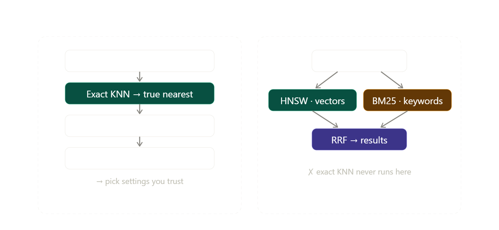

## So how does HNSW "ground itself" at query time?

- It doesn't. At runtime HNSW simply walks its graph and returns its best-guess nearest vectors. It has **no idea** whether it missed a closer one — there's no truth to check against in the moment.
- The only "grounding" already happened **offline**: your earlier benchmark against eKNN told you something like *"at efSearch=500 we get ~98% recall,"* so you trust those settings. Live queries just run with them.
- Think of it like a speedometer calibration: you check it against a known reference *once* in the shop (offline). On the road you just trust the needle — you don't tow the reference device behind your car.

## How recall is affected through fusion and reranking

The crucial principle: **recall is decided at the retrieval stage — before any fusion or reranking.**

- If HNSW's approximation drops a relevant vector, that document is simply **absent** from the vector candidate list.
- RRF and the semantic ranker only **reorder** the candidates they're handed. They cannot add back a document that was never retrieved — *"you can't rerank what you didn't retrieve."*
- So a low HNSW recall (e.g. efSearch set too low) silently caps everything downstream: lower final recall, and MAP/MRR can't recover what isn't there.
- **But hybrid gives you a safety net**, because the two retrievers are independent:
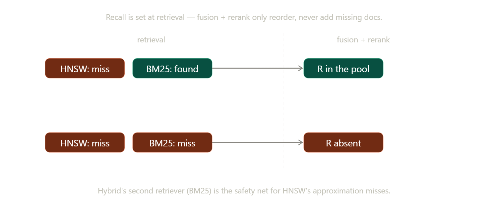
- If HNSW misses a relevant doc but BM25 matches it on keywords, the doc still enters the fused pool → it survives.
- Only if **both** retrievers miss it is it truly lost.
- This is a big part of why hybrid beats pure vector search: BM25 covers some of HNSW's approximation misses, and vector search covers BM25's vocabulary misses.
- And to be precise about what each stage can change: reranking (RRF or semantic) can raise **precision** and fix **ordering**, but it can never raise **recall** — recall is locked in the moment retrieval finishes.

## Bottom line

- Exact KNN is your **offline measuring stick**, run once during evaluation to tune HNSW — it is never fired during a live query.
- That KNN is exhaustive *vector* search, not keyword search; keyword (BM25) is a separate retriever that doesn't ground HNSW.
- At query time over 10M docs, **HNSW (vectors) and BM25 (keywords) run in parallel**, then RRF fuses them — no eKNN involved.
- HNSW doesn't self-correct at runtime; its recall is fixed by the `efSearch`/`m` you chose based on the offline benchmark.
- Recall is won or lost at retrieval. RRF and the semantic ranker only reorder — but hybrid's second retriever is exactly the mechanism that can rescue what HNSW alone would have missed.


<hr style="border:none;height:3px;background:linear-gradient(to right, #00bcd4, #673ab7)">

> **Question**
What are HNSW indexes. Are these similar to Azure Search indexes. What are indexers in Azure Ai Search.


Three things that all sound alike but are completely different — here's the quick disambiguation.

- **HNSW index** = the *data structure* (the layered proximity graph from earlier) that organizes the **vectors of one vector field** so nearest-neighbor search is fast. It's an internal, in-memory structure, not something you see directly.
- **Azure Search index** = the *container* that holds all your documents and their fields (text fields, vector fields, metadata) plus the schema and config. Think of it like a database **table**. Crucially, the HNSW index lives *inside* it — it's the structure built for that table's vector field. So they're not "similar," they're **nested**: the Search index is the cabinet; the HNSW index is a fast-lookup map inside one drawer of it.
- **Indexer** = an automated *pipeline/robot* that connects to a data source (Blob Storage, SQL, etc.), pulls the data, optionally cracks, chunks, and embeds it (via a skillset), and loads it into the Search index — on a schedule. It's a **process**, not a structure.In one line: the **indexer** loads data into the **Search index** (the container), and the **HNSW index** is just the fast-search graph built for the vector field *within* that Search index.

<hr style="border:none;height:3px;background:linear-gradient(to right, #00bcd4, #673ab7)">
