<h1 align="center">Transformers — DeepLearning.AI Notes</h1>

<hr style="border:none;height:3px;background:linear-gradient(to right, #00bcd4, #673ab7);">

> **Question**
>REQUIREMENT:
>I want you to explain every essential component in the transformer architecture diagram.
Explain details with good diagrams: Tokenization, Input & Positional Encoding, Self-Attention, Multi-Head Attention and Embeddings.

**Data-flow order** (which is exactly bottom-to-top in your Image 1): tokenization → embeddings → positional encoding → self-attention → multi-head attention → the full architecture. 

---
**Transformer Actual**
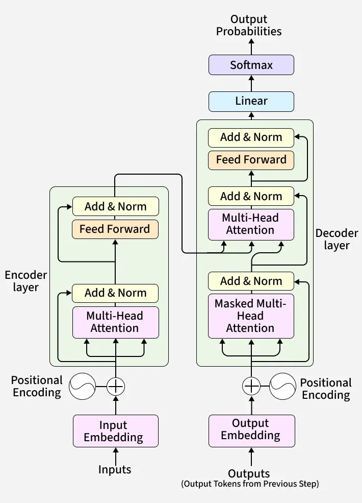


# 0. Orientation — the pipeline

Before the components, the mental model a senior engineer carries (maps to your Image 3):

- **Text is never fed to the model.** It's turned into numbers in stages: `text → tokens → token IDs → embeddings (+ position) → attention layers → output probabilities`.
- **Encoder** = *understands* input (bidirectional). **Decoder** = *generates* output (left-to-right, masked).
- **Three families**, and this is a favorite interview fork:
  - **Encoder-only** (BERT) → understanding tasks: classification, embeddings, retrieval.
  - **Decoder-only** (GPT, Llama, Claude, most LLMs) → generation.
  - **Encoder-decoder** (T5, original Transformer, your Image 1) → sequence-to-sequence: translation, summarization.
- **Production note (Azure):** the GPT models behind Azure OpenAI are **decoder-only**. The full encoder-decoder in your Image 1 is the *original* 2017 design — worth knowing, but most LLM work today is the right-hand (decoder) tower.

**Transformer Simplified**
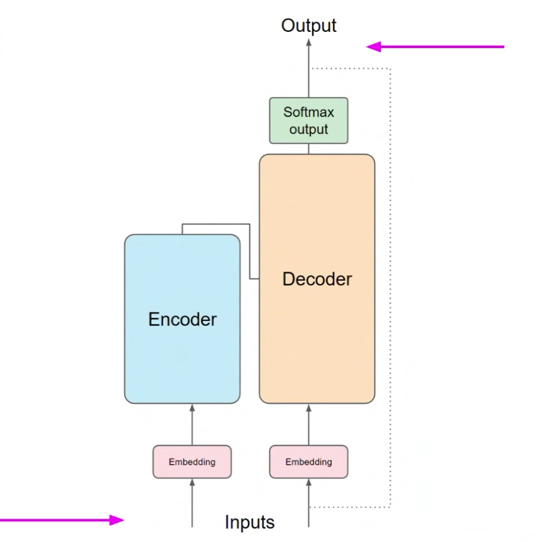
---

# 1. Tokenization

### Definition
> **Tokenization** = splitting raw text into discrete units (**tokens**) and mapping each to an integer **ID** from a fixed **vocabulary**. It is the boundary between human text and model math.


### The three approaches (and why subword won)
- **Word-level** → huge vocabulary, can't handle unseen words (`OOV` problem). ❌
- **Character-level** → tiny vocab, but sequences become very long and semantics are weak. ❌
- **Subword (BPE / WordPiece / SentencePiece)** → **the standard.** Frequent words stay whole; rare words break into reusable pieces.

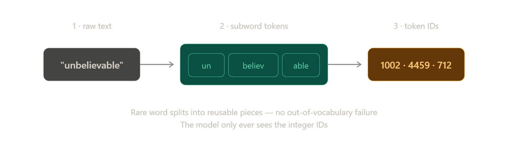

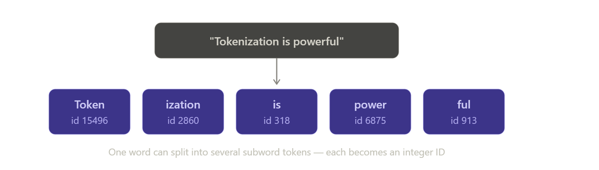

### Why it matters in production
- **Cost & context = tokens, not words.** Billing and context-window limits are per token (~4 chars / ~0.75 words in English). Non-English and code often tokenize *worse* (more tokens per word) → higher cost, faster context exhaustion.
- **Rule of thumb:** ~750 words ≈ 1,000 tokens for English prose.

### Interview Q&A
> **Scenario:** *A client complains their Azure OpenAI bill is high for a summarization feature, mostly on German legal text.*
- **Q: Why is German more expensive than English here?**
  **A:** Tokenizers are trained mostly on English, so German (long compound words) and specialized legal terms fragment into more subword tokens per word. More tokens → more cost and faster context-limit hits. I'd measure the actual token-per-word ratio, consider trimming boilerplate before sending, and evaluate whether a model with a tokenizer better suited to the language reduces token count.

---

# 2. Embeddings

### Definition
> An **embedding** is a lookup table that turns each token ID into a **dense vector** (e.g. 768 or 1536 floats) representing a token's *meaning* in a continuous space. The token ID is just an index; the embedding is the actual signal the model reasons over. This vector is the token's meaning, expressed as geometry.

### Key distinctions (high-value in interviews)
- **One-hot vs embedding:** one-hot is sparse, huge, and carries *no* similarity ("king" and "queen" are equally unrelated). Embeddings are dense and place **similar meanings close together**.
- **Static token embedding vs contextual embedding — critical:**
  - The **input embedding** (lookup table) is *static* — "bank" has one vector regardless of sentence.
  - After passing through attention layers, the representation becomes **contextual** — "bank" (river) and "bank" (money) end up in *different* places. **Attention is what makes embeddings context-aware.**
- **Distinction — two different things called "embeddings"**:
  - Token embeddings = internal input layer of the LLM (what we're describing here).
  - Sentence/document embeddings = the vector for a whole chunk, used in RAG for similarity search in a vector DB. Same idea, different granularity. (This is the bridge to your RAG background — cosine similarity in a vector store is exactly "meaning as distance.")
  
  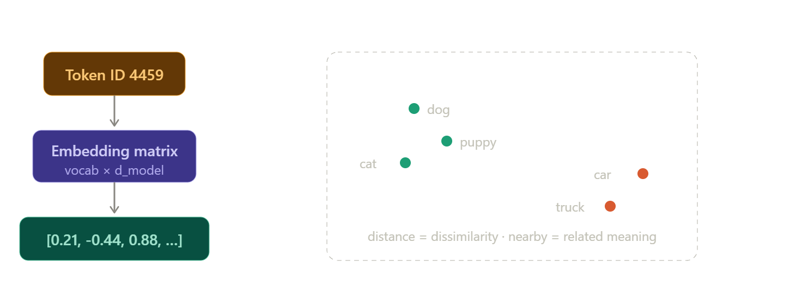
  
  ### When & why (use-case)
- **Similarity/search/RAG:** embed documents and queries, compare by **cosine similarity** → semantic search, retrieval, clustering, dedup, recommendations. This is the backbone of your RAG systems.
- **Distinction to state cleanly:** *token embeddings* (inside an LLM) vs *sentence/document embeddings* (from a dedicated embedding model like `text-embedding-3-large`). RAG uses the latter.

### Interview Q&A
> **Scenario:** *Your RAG retrieval returns irrelevant chunks even though keywords match.*
- **Q: How could embeddings be the culprit?**
  **A:** Keyword overlap ≠ semantic match. If chunks are too long, one embedding averages many topics and blurs meaning; if the embedding model is weak or domain-mismatched (e.g. general model on medical text), similar-meaning terms won't land close. I'd right-size chunks, use a domain-appropriate embedding model, and evaluate retrieval (recall@k) *separately* from generation.

---

# 3. Input & Positional Encoding

### The problem it solves
 - Self-attention looks at all tokens simultaneously, so by itself it has no sense of word order — "dog bites man" and "man bites dog" would look identical. Recurrence encoded order for free; the Transformer threw recurrence away, so order must be injected manually.

### Definition 
- Positional encoding (PE) adds a position-dependent vector to each token embedding, so the final input carries both meaning and position.

Input to encoder = Token Embedding + Positional Encoding (element-wise addition, same dimension)

### How it works
- Add a **position vector** to each token embedding (same dimension), **element-wise**:
  `input = token_embedding (meaning) + positional_encoding (order)`
- **Sinusoidal (original Transformer)** — fixed sine/cosine waves of varying frequency:

```
PE(pos, 2i)   = sin( pos / 10000^(2i / d_model) )
PE(pos, 2i+1) = cos( pos / 10000^(2i / d_model) )
```

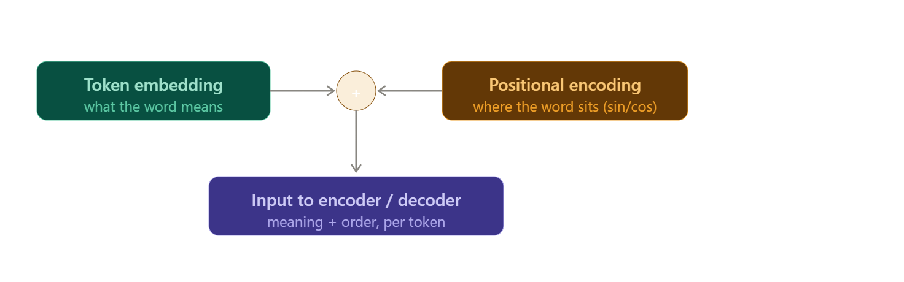

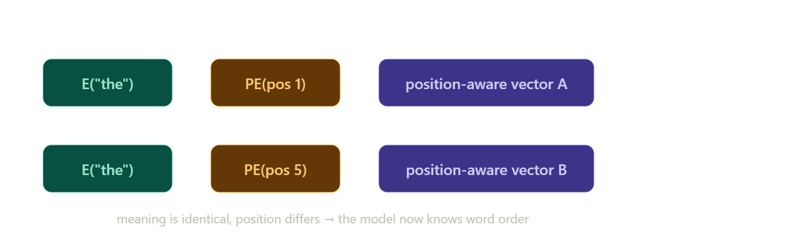

### Distinction: sinusoidal vs learned vs RoPE
- **Sinusoidal (fixed):** no parameters; can extrapolate to longer sequences; original design.
- **Learned absolute:** positions are trainable embeddings; simple, used by BERT/GPT-2; poor at extrapolating beyond trained length.
- **RoPE (Rotary Position Embedding) — what modern LLMs use (Llama, most 2023+ models):** rotates Q/K by position so attention depends on *relative* distance. 
It is a technique used in modern Large Language Models (LLMs) to encode word order. Instead of simply adding a position value to a word's meaning, RoPE acts like a compass by geometrically rotating the model's Query and Key vectors in multi-dimensional space based on their position in the sequence.
**Better long-context generalization** — this is the answer that signals you're current.

### Interview Q&A
> **Scenario:** *A model trained on 4k-token inputs degrades badly at 16k tokens.*
- **Q: What's likely happening and how do positional schemes relate?**
  **A:** The model is seeing positions it never trained on. With learned absolute positions it can't represent them at all. This is why long-context models use RoPE (often with scaling tricks like NTK/YaRN) — relative position generalizes better. Practically, I'd either use a model natively trained for that context length or apply a validated context-extension method rather than assuming it "just works."

---

# 4. Self-Attention *( the heart of the Transformer )*

### Definition
 **Self-attention** is a machine learning mechanism that allows a model to evaluate the relationships between all words (or tokens) within the same sequence. It lets every token look at every other token in the sequence and build a new representation as a **relevance-weighted blend** of them. It's how the model figures out *which words matter to which*.

**Definition:** A mechanism where every token builds a new representation of itself as a weighted blend of all other tokens, where the weights encode relevance. It answers, for each word: "which other words should I pay attention to, and how much?"

### The Q / K / V intuition
Each token projects into three learned vectors:

**Calculate Q, K, and V vectors**: 
- Every word's embedding is transformed into three distinct vectors using trained weight matrices:
- Query (Q): Represents the word the model is currently focusing on.
- Key (K): Represents all other words in the sentence being evaluated as reference points.
- Value (V): The actual content or meaning of the word | the actual content I'll hand over if you attend to me

| Vector | Role | Plain-English question |
|---|---|---|
| **Query (Q)** | what I'm looking for | Represents the word the model is currently focusing on - "what's relevant to *me*?" |
| **Key (K)** | what I offer | Represents all other words in the sentence being evaluated as reference points - "here's what *I'm* about" |
| **Value (V)** | my actual content | The actual content or meaning of the word - "here's my information to share" |

**Mechanism (say it in 4 steps):**
1. **Q · Kᵀ → raw relevance Score** = each token's Query · every token's Key (dot product → relevance).
2. **÷ √dₖ → Scale** (keeps gradients stable — large dimensions blow up dot products).
3. **Softmax →** scores become weights summing to 1.
4. **· V → Weighted sum of Values** → the token's new, context-aware representation.

### The formula (memorize this exactly)

```
Attention(Q, K, V) = softmax( Q · Kᵀ / √d_k ) · V
```

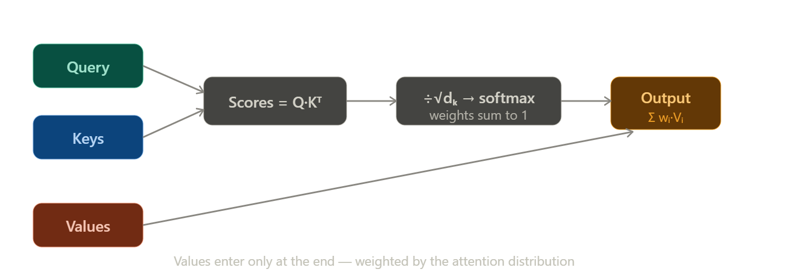

Here's the graphic in your attached arc style — **amber = strong attention, gray = weaker learned links**. "taught" attends most to its subject "teacher" and object "student":

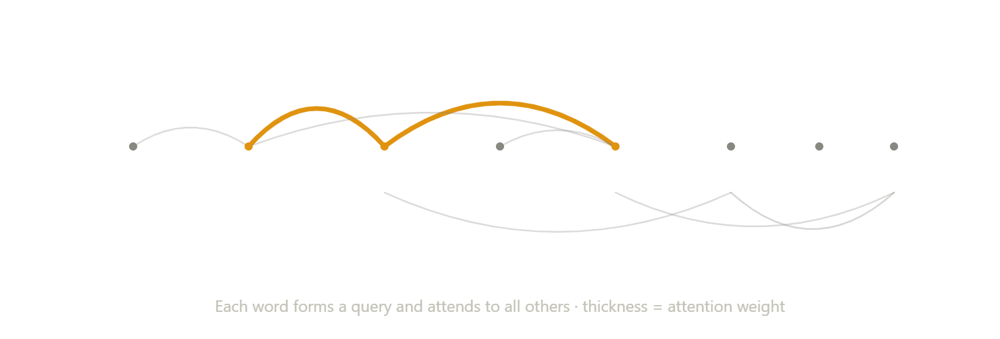

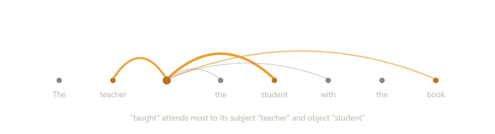

### Two variants you must distinguish
- **Full (bidirectional) self-attention** — encoder: every token sees every other token. Used for *understanding*.
- **Masked (causal) self-attention** — decoder: a token can only see tokens *before* it (future positions masked to −∞ before softmax). This is what makes generation left-to-right and prevents "cheating" by peeking at the answer.

### The cost caveat (senior signal)
> Attention is **O(n²)** in sequence length — every token attends to every token. Doubling context ≈ 4× the compute. This is *the* reason long-context and efficient-attention work (FlashAttention, RoPE, KV-caching, sparse/sliding-window attention) exists.

### Interview Q&A
> **Scenario:** *A teammate asks why the decoder needs "masking" but the encoder doesn't.*
- **Q: Explain the difference and why it matters.**
  **A:** The encoder reads the whole input at once, so bidirectional attention is fine — understanding benefits from seeing both sides. The decoder *generates* one token at a time; if it could see future tokens during training it would trivially cheat, and it wouldn't match inference where the future doesn't exist yet. Causal masking enforces that each position only attends to itself and earlier positions, keeping training and generation consistent.

---

# 5. Multi-Head Attention

### Definition
> Instead of computating attention **once**, run **h times parallel**, each head has its *own* learned Q/K/V projections, then **concatenate** and **linearly project** the results.

### Why (the core intuition)
- One head = **one relationship lens**. One point of view. A single head is forced to average all relationship types together.
Multiple heads let the model attend to **different relationship types simultaneously**:
  - one head → subject-verb links,
  - another → coreference ("it" → "animal"),
  - another → long-range topic.
- Analogy: reading a sentence with several experts — a grammarian, a fact-checker, a tone-reader — each annotating in parallel, then merging notes.
- Each head works in a **smaller subspace** (`d_model / h`), so total cost ≈ one full-size attention — you get diversity *for free*.
- **One-liner:** Multi-head attention lets the model attend to information from different representation subspaces at once.

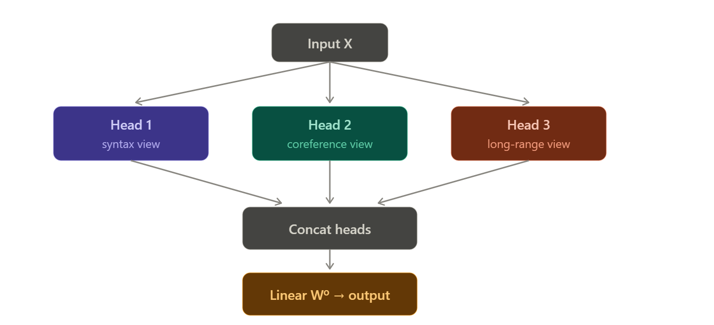

### Interview Q&A
> **Scenario:** *Someone proposes "just use one big attention head instead of many small ones — simpler."*
- **Q: Why is multi-head usually better?**
  **A:** A single head must average all relationship types into one attention pattern, so competing signals (syntax vs coreference vs topic) blur together. Splitting into heads lets each specialize in a different subspace and pattern, then the results are combined — richer representations at essentially the same compute. Empirically it's why the original paper used multi-head; collapsing to one head measurably hurts quality.

---

# 6. Full architecture — every component (your Image 1)

Reading **bottom-to-top**, here's every box and what it does. The stack repeats **N times** (e.g. 12, 24, 96 layers).

### Shared bottom (both towers)
- **Input / Output Embedding** — token IDs → dense vectors (Section 2).
- **Positional Encoding (⊕)** — add order to meaning (Section 3).

### Encoder layer (left tower) — *understands the input*
- **Multi-Head Attention** — full/bidirectional self-attention over the input (Sections 4–5).
- **Add & Norm** — two mechanisms bundled:
  - **Add = residual connection** (`x + sublayer(x)`) → lets gradients flow through deep stacks; without it, deep Transformers won't train.
  - **Norm = layer normalization** → stabilizes activations, speeds/steadies training.
- **Feed Forward (FFN)** — a per-token 2-layer MLP (expand → non-linearity → contract). **This is where most parameters live** and where a lot of "knowledge" is stored; attention mixes tokens, the FFN *processes* each one.
- Another **Add & Norm**.

### Decoder layer (right tower) — *generates the output*
- **Masked Multi-Head Attention** — causal self-attention; can't see future tokens (Section 4).
- **Add & Norm.**
- **Multi-Head Attention (cross-attention)** — **the bridge**: Queries come from the decoder, **Keys & Values come from the encoder output**. This is how the output attends to the input (e.g. each generated word looks at the source sentence in translation).
- **Add & Norm** → **Feed Forward** → **Add & Norm.**

### Top (output head)
- **Linear** — projects the final vector to **vocabulary size** (one score/logit per possible token).
- **Softmax** — logits → **probability distribution** over the vocabulary → **Output Probabilities**. Decoding (greedy / top-k / top-p / temperature) picks the next token from this.### The three families — when to use each (production framing)

| Family | Uses | Best for | Real models |
|---|---|---|---|
| **Encoder-only** | Encoder + bidirectional attn | understanding: classification, **embeddings/retrieval** | BERT, `text-embedding-3` |
| **Decoder-only** | decoder stack, masked attention, **no cross-attention** | **generation, chat, most LLMs** | GPT-4o, Llama, Claude |
| **Encoder-decoder** | both towers + cross-attention | seq-to-seq: translation, summarization | T5, original Transformer |

### **The three components that trip people up**

- **Add & Norm** = Residual + LayerNorm. **Residuals** let gradients flow through very deep stacks (no vanishing); **LayerNorm** keeps activations stable. Without these, you can't train a deep Transformer at all.
- **Masked (causal) attention**. During generation, a token must not see the future — otherwise it's cheating by peeking at the answer. The mask sets future positions to −∞ before softmax. **This is the single feature that makes generation possible.**
- **Cross-attention** is the only place the decoder reads the encoder. Remove it and you have a decoder-only model.

**Key realization for interviews:** decoder-only LLMs (what you'll use on Azure OpenAI) **drop the encoder and cross-attention entirely** — they're just the masked-attention → FFN block stacked deep. The full two-tower diagram is the *original* design; know it, but don't assume every LLM has an encoder.

### Interview Q&A
> **Scenario:** *A client wants (a) semantic search over their knowledge base and (b) a chatbot that answers from it. An architect suggests "one big model for both."*

**Q1 — How do the architecture families guide your design?**
  - **A:** These are two different jobs. Search needs an **encoder-style embedding model** to turn documents and queries into vectors for similarity — that's understanding, not generation. The chatbot needs a **decoder-only generative LLM**. So I'd use an embedding model for retrieval and a separate generative model for answering — i.e. RAG: embed + retrieve, then generate grounded on the results. Forcing one model to do both is the wrong tool for at least one of the tasks.

**Q2 (follow-up) —  Why don't decoder-only LLMs have cross-attention if the encoder-decoder does?**
  - **A:** Cross-attention exists to let a *separate* output sequence attend to a *separate* encoded input. A decoder-only LLM has no separate input sequence — the prompt and the generation are one continuous stream, so causal self-attention over that single stream already lets generated tokens attend to the prompt. No second tower means no bridge needed.


>**Scenario:** You're explaining to a stakeholder why your Azure-hosted chatbot has a token limit and why long documents cost more — grounding it in the architecture.

**Q3 — "Why is there a hard context limit at all?"**
  - Self-attention is O(n²): every token attends to every other, so doubling the input roughly quadruples attention compute and memory. The limit is where quality, latency, and cost stay acceptable — not an arbitrary cap.

**Q4 — "The same paragraph costs different amounts on different days — why?"**
  - Billing is per token, and tokenization is subword — rare words, code, and other languages fragment into more tokens than plain English. Same visible text, different token count. I'd measure real usage with tiktoken, not word count.

**Q5 — "Why does the model sometimes lose track of instructions early in a long prompt?"**
  - Two forces: attention weight spreads thinner across many tokens, and models show a "lost in the middle" bias — strongest recall at the start and end of context. Mitigation: put critical instructions at the top or bottom, and for long docs use RAG to feed only relevant chunks instead of the whole thing.
---

That's the full bottom-to-top path with every component in your Image 1 covered, formulas where they matter, and a scenario Q&A per section.

Natural next steps from here, whenever you want them: **the FFN / MoE internals**, **decoding strategies** (greedy vs top-k vs top-p vs temperature — high-yield for product roles), **KV-cache** (why inference is fast and why context costs memory), or moving up the stack into **RAG architecture** and **evaluation**.

<hr style="border:none;height:3px;background:linear-gradient(to right, #00bcd4, #673ab7);">

> **Question**
Great Explanations
>Explain: Feed-Forward Networks, Add & Norm, Softmax Layer for Output Prediction

Solid — these three are the "supporting cast" that interviewers use to separate people who memorized the attention headline from people who actually understand a Transformer block. Here's each, repo-formatted.

# 1. Feed-Forward Network (FFN)

**Definition:** A small **position-wise** neural network applied to **each token independently** *after* attention. Two linear layers with a nonlinearity between them:

```
FFN(x) = W₂ · activation(W₁ · x + b₁) + b₂
```

**The one distinction that matters — attention vs FFN:**

| | Attention | Feed-Forward |
|---|---|---|
| Direction of work | **Across** tokens (mixing) | **Within** each token (independent) |
| Job | *Gather* relevant context | *Process / think about* what was gathered |
| Cross-token info? | Yes | **No** |

> **The mental model to say out loud:** *"Communicate, then compute."* Attention lets tokens **talk to each other**; the FFN lets each token **think privately** about what it just heard.

**Key facts:**
- It **expands then contracts**: `d_model → d_ff → d_model`, where `d_ff` is usually **4× wider** (e.g. 4096 → 16384 → 4096). The wide middle is where capacity lives.
- **~⅔ of a Transformer block's parameters live here** — not in attention. Interpretability work suggests the FFN acts like **key-value memory storing factual knowledge**.
- **Activation:** ReLU originally → **GELU / SwiGLU** in modern LLMs.
- **Production hook — Mixture of Experts (MoE):** replaces the one dense FFN with many "expert" FFNs + a **router** that activates only a few per token (Mixtral, rumored GPT-4). Same params, far less compute per token. Naming this signals you're current.

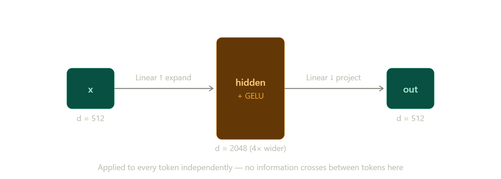

# 2. Add & Norm

This one label hides **two independent tricks**. Break them apart in an interview.

## Part A — Add = Residual (skip) connection

**Definition:** Add the sublayer's input back to its output before passing on:

```
output = LayerNorm( x + Sublayer(x) )
```

**Why it exists (the killer point):**
- It creates a **gradient highway** — gradients flow *directly* backward through the `+`, bypassing the sublayer. This is what makes it possible to **stack dozens of layers** without vanishing gradients.
- Each layer only has to learn a **small refinement (a "delta")** to the running representation, not rebuild it from scratch. Much easier to optimize.
- **Callback to your RNN answer:** this is the Transformer's *structural* fix for the same vanishing-gradient problem that killed deep RNNs.

## Part B — Norm = Layer Normalization

**Definition:** Normalize a **single token's** feature vector to mean 0 / variance 1, then apply learned scale + shift. Keeps activations in a stable range → stable, faster training.

**The distinction interviewers love — LayerNorm vs BatchNorm:**

| | LayerNorm | BatchNorm |
|---|---|---|
| Normalizes across | **Features of one token** | Same feature across the **batch** |
| Depends on other samples? | **No** | Yes |
| Good for sequences / variable length? | **Yes** | No (unstable) |

> **Why LayerNorm for Transformers:** it's **independent of batch size and sequence length**, so it behaves identically in training and at inference on a single sequence. BatchNorm breaks with variable-length text and small batches.

**Current-practice note (say this to sound up-to-date):**
- **Post-LN** (original paper) = norm *after* the add → harder to train, needs learning-rate warmup.
- **Pre-LN** (modern LLMs) = norm *before* the sublayer → much more stable; the default today.
- **RMSNorm** (LLaMA) = cheaper LayerNorm variant, no mean-centering.# 3. Softmax Layer for Output Prediction

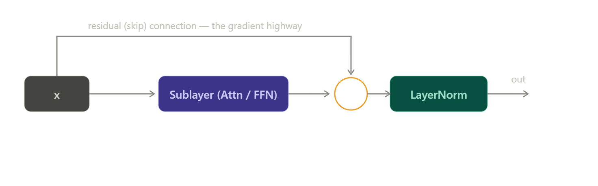

**Definition:** The final stage that turns the last hidden vector into a **probability distribution over the entire vocabulary**, so the model can pick the next token. Two sub-steps:

1. **Linear layer (the "LM head" / unembedding):** projects the final hidden state `[d_model]` → **logits** `[vocab_size]` — one raw score per possible token (~100k of them). Often **weight-tied** with the input embedding matrix.
2. **Softmax:** converts those logits into **probabilities that sum to 1**.

**The single most important reframe (interviewers probe this):**

> An LLM does **not** "output a word." It outputs **P(next token | everything so far)** — a probability over *every* token in the vocabulary. A **separate decoding step** then chooses one.

**That separation → decoding strategies:**

| Strategy | How it picks | Effect |
|---|---|---|
| **Greedy** | Always the argmax | Deterministic, can be dull/repetitive |
| **Temperature** | Scales logits `÷ T` before softmax | `T<1` sharper/safer · `T>1` flatter/creative · `T=0` ≈ greedy |
| **Top-k** | Sample from top *k* tokens | Caps the candidate pool |
| **Top-p (nucleus)** | Sample from smallest set summing to *p* | Adapts pool size to confidence |

- **Autoregressive loop:** pick a token → **append it** → feed the whole sequence back in → predict the next. Repeat until a stop token. *(This is why the KV-cache exists — to avoid recomputing everything each step.)*

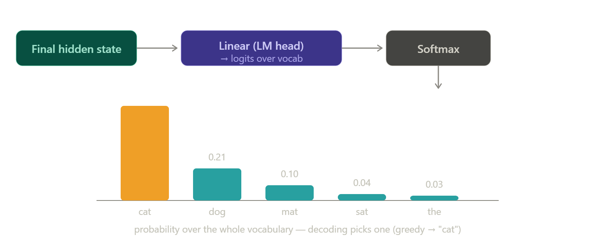

---

## How the three fit inside one block

> **attention → Add&Norm → FFN → Add&Norm**, repeated N times, then **Linear → Softmax** once at the very top.

Attention mixes across tokens, **Add&Norm** keeps that stack trainable and stable, the **FFN** lets each token process what it gathered, and **Softmax** at the end converts the final vector into the next-token distribution.

---

# Scenario-based interview Q&A

**Scenario:** *Your Azure-hosted assistant gives repetitive, robotic answers. A teammate wants to "fine-tune it to be more creative." Diagnose it using the architecture.*

**Q1 — "Where does 'creativity' actually get controlled?"**
Not in the weights first — at the **softmax/decoding** stage. Repetitive output usually means **greedy or very low temperature**. I'd raise **temperature** and add **top-p** sampling before touching training. It's a config change, not a fine-tune — cheaper, instant, reversible.

**Q2 — "Why not just fine-tune, like they suggested?"**
Fine-tuning changes **behavior and style**, but repetition here is a **decoding artifact**, not a knowledge gap. Fine-tuning would be expensive overkill for something a `temperature`/`top_p` parameter fixes. I'd only fine-tune if the *content or tone* were wrong across the board.

**Q3 — the depth probe — "The FFN holds most of the parameters. If we want the model to *know* more domain facts, is decoding enough?"**
No — that's the flip side. Decoding controls *how* it picks from what it knows; it can't add facts. Since factual knowledge largely lives in the **FFN weights**, adding knowledge means either **fine-tuning** (bakes it into weights, hard to update) or, better for facts, **RAG** (keeps facts in an external index, citable and updatable). I'd reach for RAG for domain facts and reserve fine-tuning for behavior.

**Q4 — "Why does the model need Add & Norm at all — could we drop it to save compute?"**
No. Remove the **residuals** and gradients vanish through the deep stack — the model won't train. Remove **LayerNorm** and activations drift out of range, destabilizing training. They're cheap relative to attention and FFN, and they're what make a deep Transformer trainable in the first place. It's a structural necessity, not optional overhead.

That Q1→Q3 arc — *"decoding controls how it picks, FFN/weights control what it knows"* — is a distinction that consistently impresses.

---
Natural next steps for the repo: **decoding strategies in depth** (temperature/top-k/top-p with the math), the **KV-cache** (why generation is fast and why it dominates inference memory), or pivot to **RAG internals** to tie all of this back to your strength. Where to?

<hr style="border:none;height:3px;background:linear-gradient(to right, #00bcd4, #673ab7);">

> **Question**
>Great, now I want to move onto the Generation configurations.
>  - Explain what is greedy and random sampling.
>  - Explain the `max-promt-token` and `max-completion-token` and their significance.
> - Explain Top-k and Top-p in detail.
> - Explain temperature and where exactly is it placed around softmax layer.


Now we're into the knobs you'll actually turn in production — and GenAI Solutions interviewers love this area because it separates people who *tune* models from people who just call them. Here's the full set, repo-formatted.

# 1. Greedy vs Random (Sampling) Decoding

Both start from the **same softmax distribution** over the vocabulary — they differ only in **how they pick**.

- **Greedy decoding:** always take the **argmax** (highest-probability token) at every step. **Deterministic** — same prompt → same output.
- **Random / multinomial sampling:** **draw** the token according to its probability. A token with p = 0.25 is chosen ~25% of the time. **Stochastic** — same prompt → varied outputs.

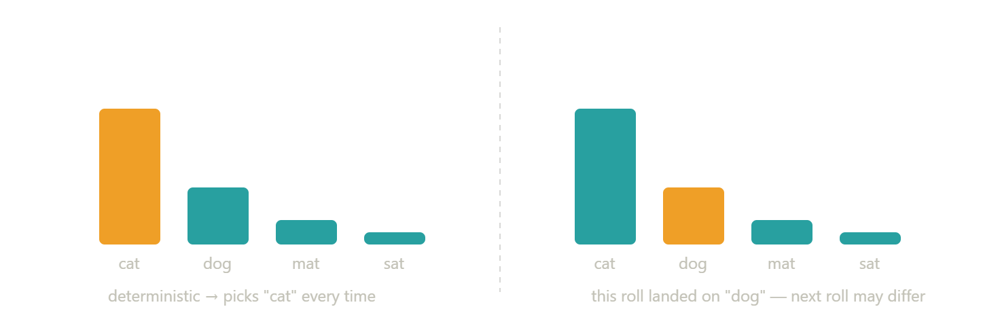

**When & why:**

| | Greedy | Random sampling |
|---|---|---|
| Output | Deterministic, safe | Diverse, creative |
| Failure mode | **Repetition / loops**, dull, myopic | **Incoherence** if unconstrained |
| Use for | Extraction, classification, structured/JSON, math | Brainstorming, marketing copy, dialogue |

> **Key relationship:** greedy is just **sampling with temperature → 0**. And raw sampling is dangerous *alone* — the long tail of ~100k tokens holds a lot of junk, so in practice you **always pair sampling with top-k/top-p** (below) to cut that tail. Pure beam search (keeping several candidate sequences) exists too, but it's mostly used in translation/summarization, not chat.

---

# 2. `max_prompt_tokens` and `max_completion_tokens`

**The frame everything hangs on — the context window is a fixed budget:**

> **prompt tokens + completion tokens ≤ context window** *(e.g. 128k)*

- **`max_prompt_tokens`** → cap on the **input** side (prompt + system + retrieved RAG context + history).
- **`max_completion_tokens`** → cap on the **output** the model is allowed to generate. *(This is OpenAI's old `max_tokens`, renamed on newer models.)*

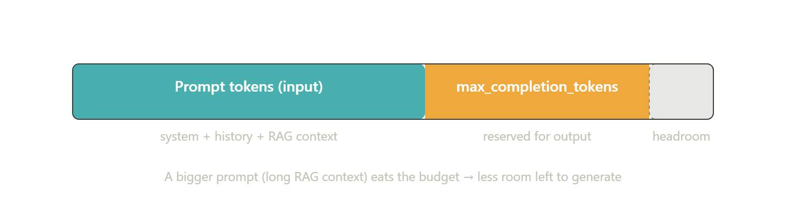

**Significance — why these two knobs matter (say all four in an interview):**

- **Cost.** You're billed on **both** — input *and* output tokens, with **output usually priced higher**. `max_completion_tokens` is your hard ceiling on the expensive side.
- **Latency.** Generation is sequential — each output token is another forward pass. Fewer completion tokens = faster response.
- **Truncation risk.** If the model hits `max_completion_tokens` mid-answer, it's **cut off** (you'll see `finish_reason: "length"`). Common bug: JSON output that stops before the closing brace.
- **The squeeze (RAG-specific).** In RAG, retrieved chunks live in the **prompt** budget. Over-retrieve and you starve the completion — or blow the window entirely. **Always reserve output headroom** rather than filling the prompt to the brim.

---

# 3. Top-k and Top-p (Nucleus) Sampling

Both are **truncation filters**: they shrink the candidate pool *before* sampling, chopping off the low-probability tail so random sampling can't wander into nonsense. They differ in **how they draw the cutoff**.

- **Top-k:** keep the **k highest** tokens, discard the rest, renormalize, sample. → **fixed count.**
- **Top-p (nucleus):** keep the **smallest set whose cumulative probability ≥ p**, renormalize, sample. → **adaptive count.**

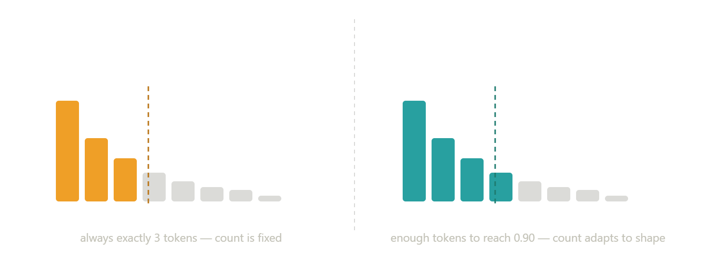

**The distinction that wins the point — why top-p is usually preferred:**

- **Top-k is blind to the distribution's shape.** With `k=50`: if the model is **highly confident** (one token at 0.95), you've still dragged in 49 junk tokens as sampling candidates. If it's **very flat**, `k=50` might chop off legitimate options.
- **Top-p adapts.** Confident step → the nucleus is **tiny** (maybe 1–2 tokens, so it behaves almost greedily). Uncertain step → the nucleus **grows** to admit more options. It matches the pool size to the model's actual confidence.

| | Top-k | Top-p (nucleus) |
|---|---|---|
| Cutoff by | Fixed **count** | Cumulative **probability** |
| Adapts to confidence? | **No** | **Yes** |
| Typical value | k = 20–50 | p = 0.9–0.95 |

> You can **stack** them: apply top-k first as a safety cap, then top-p. Many production defaults do exactly this.

---

# 4. Temperature — and exactly where it sits

**Definition:** A scalar **T** that reshapes the distribution's *sharpness* by dividing the **logits** before softmax:

```
                       exp(logitᵢ / T)
softmax_T(logitᵢ) = ─────────────────────
                      Σⱼ exp(logitⱼ / T)
```

**The precise placement answer (this is what your question is really after):**

> **Temperature is applied to the *logits*, i.e. *before* softmax — not after.** Softmax outputs probabilities that already sum to 1; scaling *those* would just require renormalizing and lose the effect. Scaling the **raw logits** is what actually sharpens or flattens the curve.

Order of operations in a real decoding pipeline:

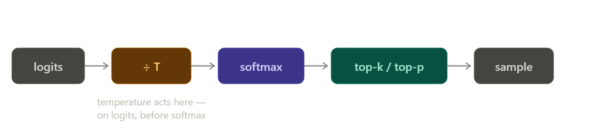

**The effect — and the intuition:**

- **T < 1** (e.g. 0.2): dividing by a small number **magnifies** logit gaps → softmax gets **peakier** → more deterministic. As **T → 0** it becomes **greedy**.
- **T = 1:** the model's raw distribution, untouched.
- **T > 1** (e.g. 1.5): dividing by a big number **compresses** logit gaps → softmax **flattens** → more random / creative / riskier.

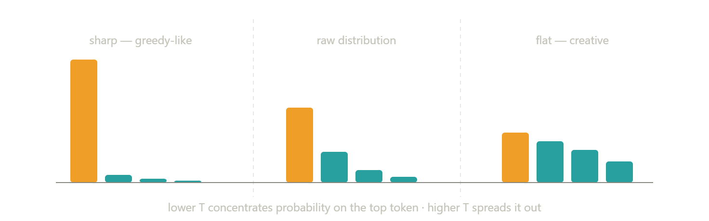
---

## Putting it together — config recipes by task

This table is gold for a Solutions interview, because it shows you map **settings → outcomes**:

| Task | Temperature | Top-p | Why |
|---|---|---|---|
| Extraction / classification / JSON | **0** (greedy) | — | Need deterministic, reproducible output |
| Code generation | 0 – 0.2 | 0.95 | Mostly deterministic, slight flexibility |
| RAG / factual Q&A | 0 – 0.3 | 0.9 | Stay grounded, minimize invention |
| Chat assistant | 0.7 | 0.9 | Natural, varied but coherent |
| Brainstorm / marketing copy | 0.9 – 1.2 | 0.95 | Maximize diversity |

> **Practitioner's note:** don't crank **temperature *and* top-p** both high at once — you compound randomness and get incoherence. The common pattern is to **fix top-p ≈ 0.9 and tune temperature** as your main creativity dial.

---

# Scenario-based interview Q&A

**Scenario:** *Your RAG assistant on Azure OpenAI occasionally (a) invents facts not in the retrieved docs, and (b) sometimes returns answers cut off mid-sentence. Diagnose and fix using generation config.*

**Q1 — "The assistant invents facts. What config changes do you try first?"**
Before anything expensive, I'd lower **temperature toward 0** and tighten **top-p to ~0.9**. Grounding failures often come from too much sampling freedom letting the model drift off the retrieved context. Config is instant and free; I'd only investigate retrieval quality or prompting after ruling this out.

**Q2 — "Answers get cut off mid-sentence. Why, and what's the fix?"**
That's `max_completion_tokens` being hit — `finish_reason` will read `"length"`. Fix is to raise the completion cap, but I'd also check the **budget squeeze**: if retrieval is stuffing the prompt, there's little window left for output. I'd cap retrieved context and **reserve explicit output headroom** so prompt + completion comfortably fit the window.

**Q3 — the depth probe — "Why not just set temperature to 0 everywhere and be safe?"**
For factual/extraction paths, I would. But T=0 makes chat feel robotic and repetitive, and greedy is **myopic** — locally best token, not globally best sentence — so it can loop. I'd tune temperature **per route**: near-0 for the grounded RAG answer, higher for any conversational or creative surface. One global setting rarely fits a whole product.

**Q4 — the "do you really get it" probe — "A teammate lowers temperature to fix hallucination but sets top-k to 1. Redundant?"**
Effectively yes — **top-k=1 is already greedy**, so it ignores temperature entirely (there's only one candidate to pick). That's a config smell: they've applied two overlapping controls. I'd use *either* temperature≈0 *or* greedy decoding, and keep top-p as the pool-shaping dial, rather than stacking controls that cancel each other's intent.

That Q4 point — **top-k=1 ≡ greedy, so temperature becomes a no-op** — is exactly the kind of subtle interaction interviewers use to test whether you understand these knobs mechanically or just by reputation.

---

Natural next steps for the repo: **repetition controls** (frequency vs presence penalty, `no_repeat_ngram`), the **KV-cache** (why each of these output tokens is cheap after the first), or pivoting to **RAG internals** — chunking, retrieval, re-ranking — to build on your strength. Where to?